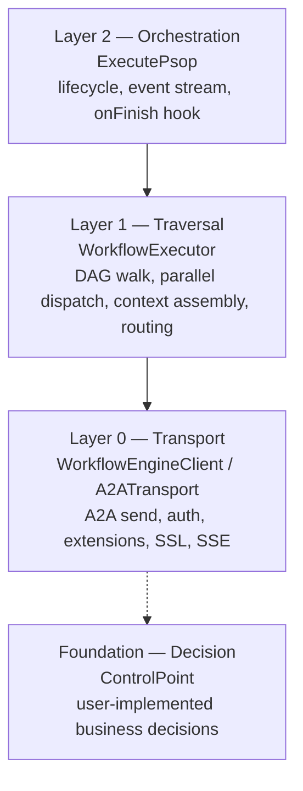
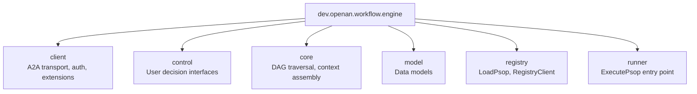

# A2A-T Workflow Execution Engine (Java)

[](LICENSE)
[](https://adoptium.net/)
[](https://maven.apache.org/)

A Java SDK embedded in a host agent for executing multi-agent workflows over the [A2A protocol](https://a2aproject.github.io/a2a-java/)
with [A2A-T](https://projects.tmforum.org/a2aproject/telecommunication/extensions/) telecom extensions.

The engine handles workflow scheduling, A2A envelopes, transport, task waiting, authentication and TLS. Host callbacks
return final message content and own any A2A-T generation, schema, validation or LLM calls.

## Features

- **A2A-T Extension Support**: Task-T (structured task prompts), Negotiation-T (stateless auto negotiation loop),
  Authorization-T (independent authorization operation), Notification-T (independent long-lived SSE subscription)
- **Content-neutral callbacks**: final MessageContent, complete ReceivedMessage, local multi-output TaskResult and
  explicit NegotiationReply.Send/Stop
- **Minimal A2A-T dependency**: a2a-t-core only in the engine; content generation and template queries use the host's
  explicit a2a-t-client dependency
- **DAG Workflow Execution**: Parallel dispatch, self-loop steps, conditional routing
- **Multi-Protocol Transport**: REST, JSON-RPC, and gRPC auto-selected from AgentCard
- **Authentication**: Bearer token login with TTL cache, AES-256-GCM encrypted credentials, custom `AuthProvider`
- **HTTPS/TLS**: Configurable trust store, self-signed cert support for development
- **Protocol Logging**: actual HTTP/JSON-RPC boundaries and gRPC metadata/protobuf views;
  bodies default on at DEBUG with mandatory secret-field redaction

Protocol documents are integration inputs, not executable truth. The pinned A2A-T SDK templates, slot schemas,
canonical URIs, and validation results are authoritative. Protocol generation and validation fail closed; raw text is
never sent under an A2A-T URI as a fallback.

The SDK is embedded in a host agent. It schedules workflow tasks to dispatched agents and returns complete results to
the host callbacks. Task-T, Authorization-T, and Notification-T use independent transport/runtime/context instances.
Authorization and Notification are independently triggered host-agent operations rather than DAG nodes; a notification
subscription remains open until the host-defined terminal event, explicit cancellation, or shutdown.

## Quick Start

### 1. Add Maven dependency

A2A-T SDK `1.1.0` is published to Maven Central. Maven resolves it automatically; no SDK source checkout or local SDK
build is required. The engine depends only on
`a2a-t-core`; host agents using content generation explicitly add `a2a-t-client:1.1.0`. A dispatched-agent service that
validates received extension content adds `a2a-t-server:1.1.0`. See the bilingual
[Developer Guide](docs/en/DEVELOPER_GUIDE.md) / [开发者指南](docs/zh/DEVELOPER_GUIDE.md) for dependency and
upgrade guidance.

```xml
<dependency>
    <groupId>net.openan.workflow.sdk</groupId>
    <artifactId>workflow-engine</artifactId>
    <version>1.0.0</version>
</dependency>
```

For Spring Boot server-side integration:

```xml
<dependency>
    <groupId>net.openan.workflow.sdk</groupId>
    <artifactId>spring-boot-starter</artifactId>
    <version>1.0.0</version>
</dependency>
```

### 2. Execute a workflow

The complete, compiled example is [HostQuickStart.java](samples/src/main/java/dev/openan/workflow/engine/examples/demo/HostQuickStart.java).
It converts registry JSON maps to typed AgentCards, runs a remote task and local aggregation, cancels timed-out work,
and closes caller-owned transport resources. Run its main method in IDEA with three arguments: registry URL,
target AgentCard name, and credentials JSON path. The registry and target agent must be reachable; TLS verification is enabled.

```java
// In the samples module; HostQuickStart is example source, not a class shipped in the SDK jar.
HostQuickStart.main(new String[] {
    "https://registry.example.com",
    "Your Agent Name",
    "/secure/credentials.json"
});
```

This minimal example sends plain A2A content. For Task-T, Negotiation-T, Authorization-T and Notification-T content
generation/validation in host-agent business callbacks, follow the business callback guide.

Final content callbacks, complete dependency inputs and negotiation
Send/Stop: [English](docs/en/BUSINESS_CALLBACKS.md) / [中文](docs/zh/BUSINESS_CALLBACKS.md).

## Architecture



| Layer      | Entry Point                             | Responsibility                                                                   |
|------------|-----------------------------------------|----------------------------------------------------------------------------------|
| High       | `ExecutePsop.Builder`                   | Event stream, lifecycle, `onFinish` persistence                                  |
| Mid        | `WorkflowExecutor`                      | DAG traversal, context assembly, ControlPoint dispatch                           |
| Low        | `WorkflowEngineClient` / `A2ATransport` | A2A send, auth, extensions, SSL, SSE normalization                               |
| Foundation | `ControlPoint`                          | User-implemented business decisions (onTask, onSelfTask, onRoute, onNegotiation) |

## Package Structure



| Package    | Key Classes                                                                                                                                                                                              | Description                                                 |
|------------|----------------------------------------------------------------------------------------------------------------------------------------------------------------------------------------------------------|-------------------------------------------------------------|
| `client`   | `WorkflowEngineClient`, `DefaultWorkflowEngineClient`, `ExtensionSender`, `A2ATransport`, `AuthProvider`, `WorkflowEngineClientConfig`, `CredentialCrypto`, `AgentCardJacksonModule` | Public transport, authentication, extension, and runtime APIs |
| `control`  | `ControlPoint`, `DefaultControlPoint`, `EventCallback`, `EventType`, `NegotiationStrategy`                                                                                                               | User-facing decision interfaces                             |
| `core`     | `WorkflowExecutor`, `ContextBuilder`                                                                                                                                                                     | DAG traversal, context assembly                             |
| `model`    | `Workflow`, `WorkflowStep`, `Task`, `TaskRequest`, `MessageContent`, `TaskResult`, `NegotiationRequest`, `NegotiationReply`, `ExecutionResult`                                                           | Data models                                                 |
| `registry` | `LoadPsop`, `RegistryClient`                                                                                                                                                                             | PSOP loading and AgentCard registry                         |
| `runner`   | `ExecutePsop`                                                                                                                                                                                            | Entry point for workflow execution                          |

> **Note:** `LlmHelper` lives in the **samples** module (`dev.openan.workflow.engine.examples`), not in the `client`
> package. The workflow engine itself does not call an LLM directly.

## Documentation

### English

- [Integration Guide](docs/en/INTEGRATION_GUIDE.md) - Setup, configuration, secondary development
- [API Reference](docs/en/API_REFERENCE.md) - Public interface and class documentation
- [Business Callback Contract](docs/en/BUSINESS_CALLBACKS.md) - Host-agent callback inputs, outputs, and ownership
- [Design Document](docs/en/DESIGN.md) - Architecture, module structure, design decisions
- [Developer Guide](docs/en/DEVELOPER_GUIDE.md) - Internal architecture, contribution, debugging

### 中文

- [集成指南](docs/zh/INTEGRATION_GUIDE.md) - 安装、配置、二次开发
- [API 参考](docs/zh/API_REFERENCE.md) - 公共接口和类文档
- [业务回调集成契约](docs/zh/BUSINESS_CALLBACKS.md) - 宿主智能体回调的输入、输出与职责边界
- [架构设计](docs/zh/DESIGN.md) - 架构、模块结构、设计决策
- [开发者指南](docs/zh/DEVELOPER_GUIDE.md) - 内部架构、贡献、调试

## Modules

| Module                | Description                                                   |
|-----------------------|---------------------------------------------------------------|
| `workflow-engine`     | Core SDK: workflow execution, A2A transport, extensions, auth |
| `spring-boot-starter` | Spring Boot auto-configuration for A2A server side            |
| `samples`             | Demo applications (embedded + Spring Boot variants)           |

## License

[Apache License 2.0](LICENSE)

## Verification

Run `mvn -B clean verify` before release. The reactor verifies the engine, Spring Boot starter, callback examples,
protocol transport, negotiation, independent extension lifecycles, cancellation, error propagation, and credential
redaction. These automated tests use controlled fixtures; production endpoints, identity services, and live model
providers require a separate acceptance record.
