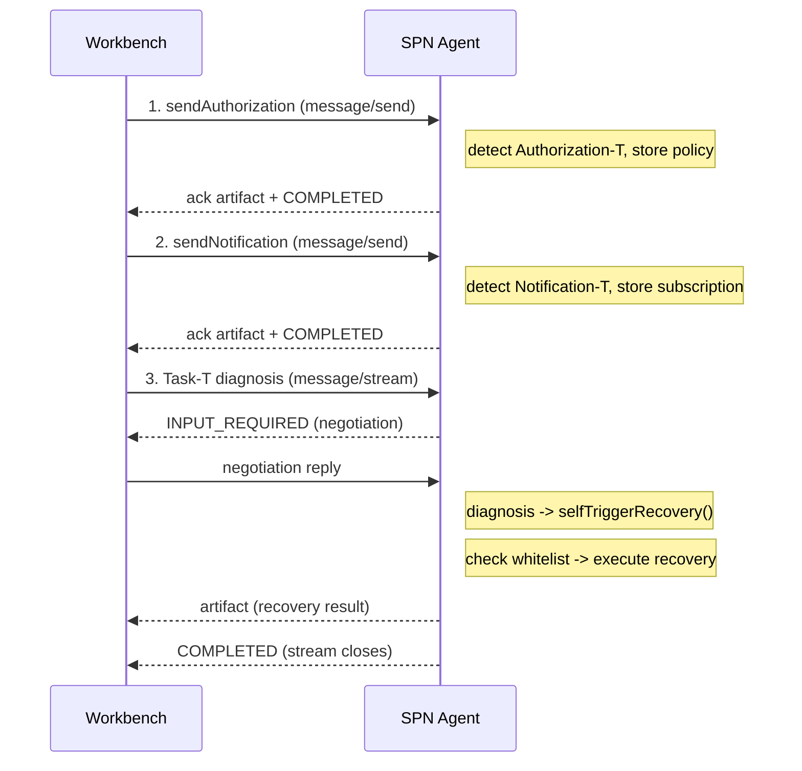
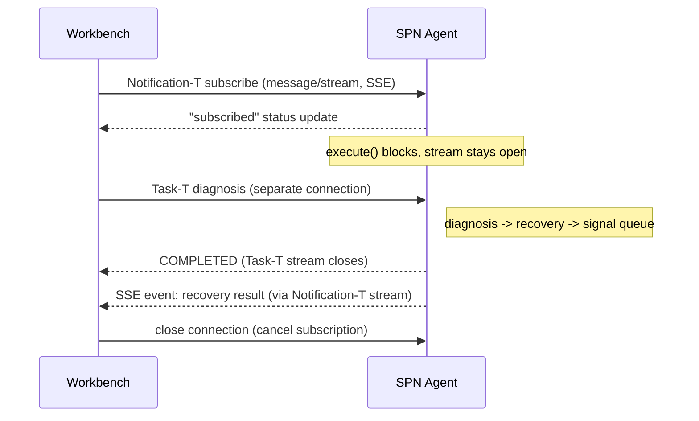
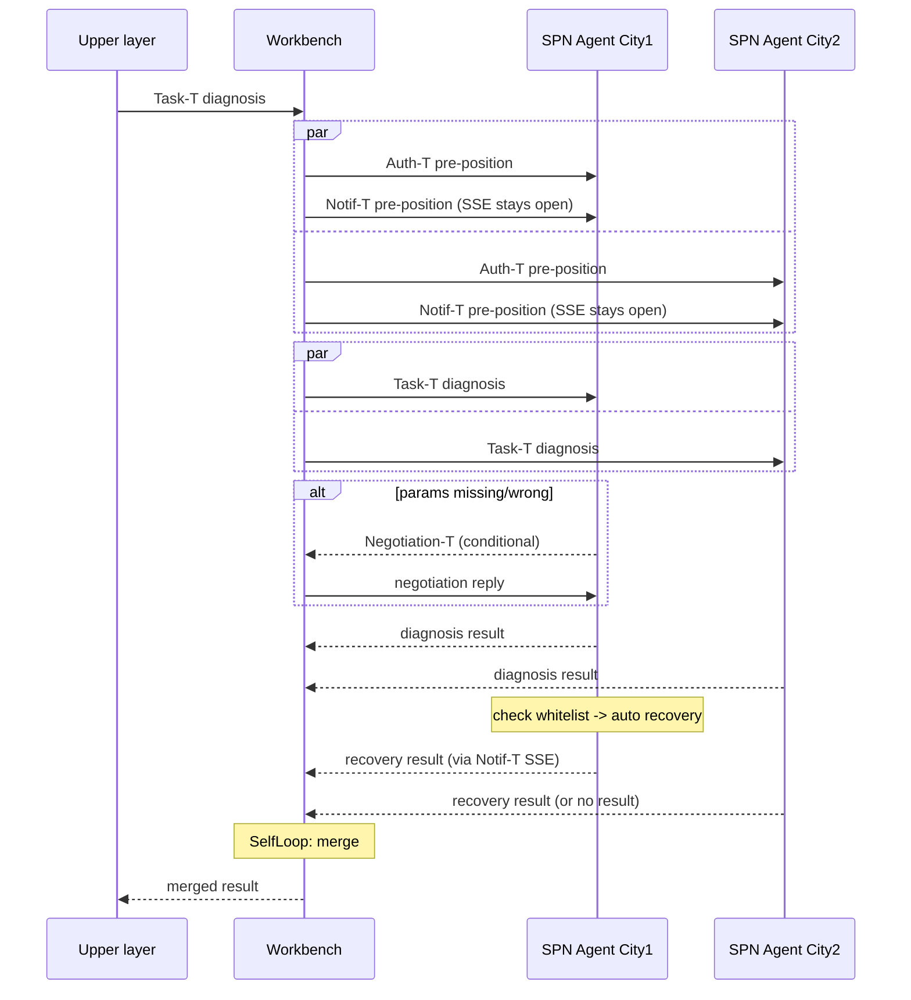

# Notification-T / Authorization-T Design Analysis

> **Superseded.** This historical analysis has been folded into
> [DESIGN.md](DESIGN.md), sections 4 (A2A-T Extension Model) and 7
> (Interaction Sequences). The pre-positioning flow described below now
> lives on `ExtensionSender` (see DESIGN.md, "Shared transport with two
> facades"), not on `WorkflowEngineClient`. Kept for reference only.

---

# Notification-T / Authorization-T Design Analysis

## Current Implementation (as of 2026-07-27)

### Pre-positioning: Three Independent One-Shot A2A Calls

The engine currently sends Authorization-T, Notification-T, and Task-T as three completely separate A2A message/send
calls. Each opens its own HTTP connection (SSE stream), gets a response, and closes.

```

```

### Key Code Locations

- sendExtensionMessage: DefaultExtensionSender.java
    - Generates metadata value via A2ATClient.generateTaskPrompt () (LLM + template)
    - Falls back to raw natural-language input if SDK unavailable
    - Calls doSendViaA2ARuntime () -> supplyAsync -> a2aClientRuntime.sendMessage ()
    - Bypasses Task-T prompt generation and Negotiation-T auto-loop

- SPN Agent pre-positioning handler: NegotiationBaseAgentExecutor.java
    - detectPrePositionedExtension (): scans message metadata for
      "Authorization-T" or "Notification-T" keywords
    - handlePrePositionedExtension (): stores payload text in volatile field, sends ack artifact + TASK_STATE_COMPLETED,
      execute () returns immediately
    - authorizationPolicy: volatile String, stored on first Authorization-T receipt
    - notificationSubscription: volatile String, stored on first Notification-T receipt

- SPN Agent recovery: SpnDomainAgentCity1Executor.java selfTriggerRecovery ()
    - getAuthorizationPolicy () to read stored whitelist policy
    - Matches policy keywords ("business recovery", "optical module", "authorization")
    - If matched: execute recovery, emit artifact with Notification-T URI in metadata
    - If not matched: emit refusal artifact with Notification-T URI in metadata

### Facts

1. Authorization-T is a static store-and-read. Policy text stored in memory, read later during Task-T diagnosis via
   getAuthorizationPolicy (). Works.

2. Notification-T subscription text is stored but NEVER READ. getNotificationSubscription () exists but is not called
   anywhere in samples code. The stored subscription text has no functional use.

3. Recovery result comes back through Task-T SSE stream, NOT through a separate Notification-T channel.
   selfTriggerRecovery () emits an artifact with Notification-T URI in artifact metadata, but this artifact is part of
   the Task-T SSE response (executeBusiness has not returned yet, execute ()
   has not returned yet, the same SSE stream is still open).

4. No long-lived connections. All three SSE streams follow open->receive->close pattern. Notification-T pre-positioning
   stream is especially short-lived:
   sends ack and closes immediately.

5. All three calls are independent. They share state only through the SPN Agent's in-memory volatile fields
   (authorizationPolicy, notificationSubscription). No persistent channel between them.

## Problem Statement

Notification-T should be a real subscription channel, not a static one-shot message. The recovery result should flow
back through the Notification-T channel (the SSE stream opened during subscription), not piggyback on the Task-T stream.

Currently:

- Notification-T subscription = send ack, close stream (no channel created)
- Recovery result = piggyback on Task-T stream artifact metadata

Desired:

- Notification-T subscription = keep SSE stream open (channel created)
- Recovery result = push through the open Notification-T SSE stream

## Proposed Design: Long-Lived SSE for Notification-T

### Concept

The workbench (client) sends a Notification-T subscription via message/stream. The SPN Agent keeps the SSE response
stream open. When recovery completes, the SPN Agent pushes the result through this stream. The client cancels by
disconnecting.

```

```

### Authentication

Forward only. The workbench authenticates to the SPN Agent when opening the SSE stream (existing bearerAuth). The SPN
Agent writes events to the response stream it already has open. No reverse HTTP call, no reverse authentication.

This eliminates the webhook reverse-call authentication problem entirely.

### Implementation Requirements

SPN Agent side (NegotiationBaseAgentExecutor):

- handlePrePositionedExtension () Notification-T branch: do NOT call emitter.complete () or return. Instead:
    1. Send "subscribed" status update (TASK_STATE_WORKING)
    2. Register this emitter/stream as the notification target
    3. Block on a queue/CompletableFuture (keep SSE stream open)
    4. When recovery completes (signaled from Task-T execute () in another thread), push a MessageEvent or
       TaskUpdateEvent with recovery result + Notification-T metadata
    5. Continue blocking until client disconnects or sends cancel

- selfTriggerRecovery () in SpnDomainAgentCity1Executor: instead of (or in addition to) emitting artifact on Task-T
  stream, signal the Notification-T stream to push the recovery result

- Thread management: two concurrent execute () calls on the same executor instance (Notification-T subscription + Task-T
  diagnosis). The A2A server must run them on separate threads.

Workbench/client side (DefaultWorkflowEngineClient):

- sendNotification () must NOT .join () and close. It must keep the SSE reader running in background, feeding events to
  a queue/callback.
- The workflow merge step must be able to wait for Notification-T events from the queue (with timeout).

Authorization-T: no change needed. Static store-and-read works fine.

### Open Questions (to align with user before implementing)

1. Does the A2A SDK (a2a-java-sdk) support keeping an SSE response stream open and pushing events to it later, after the
   initial message is processed? The current EmbeddedA2AServer / AgentEmitter model assumes execute () returns to close
   the stream.

2. How does the SPN Agent correlate the Notification-T subscription stream with the Task-T diagnosis stream? Same
   contextId? Same agent instance? A subscription registry?

3. What happens if the Notification-T SSE connection drops (network issue)? Is the subscription lost? Does the workbench
   need to reconnect?

4. Should the workflow merge step block-wait for the Notification-T result, or should it proceed with diagnosis results
   only and handle recovery results separately?

5. Timeout: if recovery never completes, how long does the Notification-T stream stay open?

6. Does the A2A-T SDK (a2a-t-sdk-java) have built-in support for long-lived Notification-T subscriptions, or do we need
   to implement this ourselves?

## Authorization-T: No Change Needed

Authorization-T is a one-way static policy push:

- Workbench sends policy text -> SPN Agent stores in memory
- During Task-T diagnosis, SPN Agent reads stored policy for whitelist check
- No response channel needed through Authorization-T

This pattern is correct and requires no modification.

## File Locations

- Engine client: workflow-engine/src/main/java/dev/openan/workflow/engine/client/DefaultWorkflowEngineClient.java
- SPN agent base: samples/src/main/java/dev/openan/workflow/engine/examples/agents/NegotiationBaseAgentExecutor.java
- SPN agent city1: samples/src/main/java/dev/openan/workflow/engine/examples/agents/SpnDomainAgentCity1Executor.java
- SPN agent city2: samples/src/main/java/dev/openan/workflow/engine/examples/agents/SpnDomainAgentCity2Executor.java
- Workbench control: samples/src/main/java/dev/openan/workflow/engine/examples/agents/WorkbenchControlPoint.java
- Demo entry: samples/src/main/java/dev/openan/workflow/engine/examples/SpnCrossCityDiagnosisDemo.java
- Agent server: samples/src/main/java/dev/openan/workflow/engine/examples/StartAgentsServer.java
- E2E test: samples/src/test/java/dev/openan/workflow/engine/examples/SpnCrossCityE2ETest.java
- AgentCard city1: samples/src/main/resources/agentcard/spn_domain_agent_city1.json
- AgentCard city2: samples/src/main/resources/agentcard/spn_domain_agent_city2.json
- AgentCard workbench: samples/src/main/resources/agentcard/transport_workbench_agent.json
- Credentials: samples/src/main/resources/spn_agent_credentials.json
- Workflow JSON: orchestration-center/data/workflow_storage/psop/psop_spn_cross_city_diagnosis.json
- Protocol examples: workflow-exec-engine-java/protocol data example.txt
- Protocol data example: workflow-exec-engine-java/调用过程.md

## Business Flow Definition (from business-flow.md / yewuliu.md)

### Four A2A-T Interfaces

| # | Extension       | Direction                                        | Purpose                                                  |
|---|-----------------|--------------------------------------------------|----------------------------------------------------------|
| 1 | Task-T          | Workbench -> SPN                                 | Diagnosis request + diagnosis result return              |
| 2 | Negotiation-T   | SPN <-> Workbench (bidirectional, SPN initiates) | Parameter correction when OMC finds missing/wrong params |
| 3 | Notification-T  | Workbench subscribes -> SPN pushes via SSE       | Recovery result subscription + push reporting            |
| 4 | Authorization-T | Workbench -> SPN                                 | Whitelist authorization policy (static, one-way)         |

### Role Clarification (confirmed with user 2026-07-27)

- Workbench IS an A2A-T Server (receives Task-T from upper layer)
- Upper layer -> Workbench: simple Task-T, NO negotiation
- Negotiation happens ONLY between Workbench and SPN Domain Agent
- Negotiation is CONDITIONAL: SPN initiates only when it finds missing/wrong parameters, not every time

### Complete Business Flow

```

```

### Key Design Decisions (confirmed)

1. Workbench = A2A Server (receives upper layer Task-T)
2. Upper layer -> Workbench: NO negotiation (just send task, get result)
3. Negotiation: Workbench <-> SPN, SPN initiates, CONDITIONAL (not every time)
4. Notification-T: long-lived SSE stream (workbench opens, SPN keeps open, pushes recovery result when done)
5. Authorization-T: static one-way push (no change from current)

## Current Demo Complexity Issues

### Problem 1: Unnecessary A2A indirection (Workbench server + workflow runner)

Current: Demo sends Task-T to Workbench Agent (A2A server) -> Workbench Agent receives task -> Workbench internally runs
workflow -> workflow sends Task-T to SPN agents.

The Workbench correctly plays both server (upper layer) and client (SPN agents) roles. But the
TransportWorkbenchAgentExecutor mixes "receive task"
and "run workflow" in one execute () call, making the flow hard to follow.

Simplification: Keep the dual role but make it cleaner:

- execute () receives the upper layer task
- Pre-positions Auth-T + Notif-T to SPN agents
- Runs the workflow (ExecutePsop)
- Waits for recovery results from Notif-T streams
- Merges and returns

### Problem 2: Negotiation forced every time

Current: NegotiationBaseAgentExecutor.handleNewTask () ALWAYS sends INPUT_REQUIRED, even when parameters are fine.

Business flow says: negotiation is conditional - SPN initiates ONLY when it finds missing/wrong parameters.

Simplification: SPN agent checks parameters first. If valid, proceed to diagnosis directly. If invalid/missing, send
INPUT_REQUIRED.

### Problem 3: Recovery result piggybacks on Task-T stream

Current: selfTriggerRecovery () emits artifact on the Task-T SSE stream.

Business flow says: recovery result goes through the Notification-T SSE stream (the one opened during subscription).

Simplification: Implement long-lived Notification-T SSE (see above).

### Problem 4: Pre-positioning not in Workbench executor

Current: Auth-T and Notif-T pre-positioning is done by the E2E test or demo code, not by the Workbench executor itself.

Business flow says: Workbench pre-positions before diagnosis.

Simplification: Workbench executor handles pre-positioning internally before starting the workflow.

### Problem 5: Agent executor inheritance chain too deep

Current:
AgentExecutor (SDK interface)
-> BaseAgentExecutor (extractText, buildStatusMessage)
-> NegotiationBaseAgentExecutor (negotiation, pre-positioning, business)
-> SpnDomainAgentCity1Executor -> SpnDomainAgentCity2Executor -> TransportWorkbenchAgentExecutor

Three levels of inheritance makes it hard to trace the flow.

Simplification: Flatten where possible. Or at minimum, make the flow in each class readable without jumping through
three files.