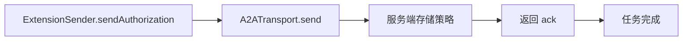
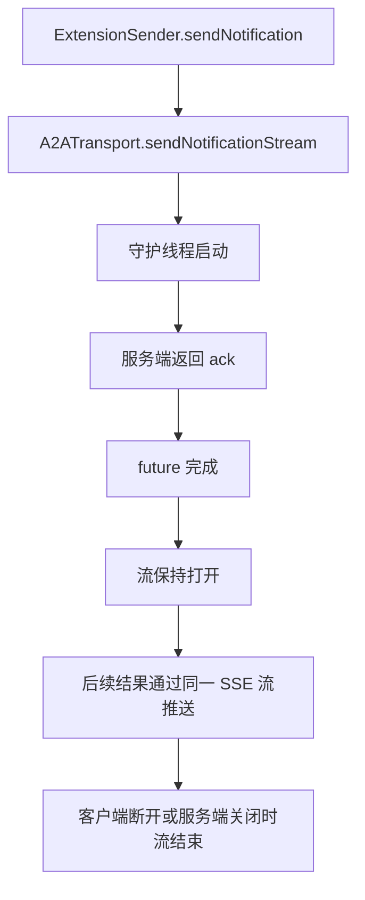

# Notification-T / Authorization-T 设计分析

> **已归档。** 本历史分析已整合到 [DESIGN.md](DESIGN.md) 的第 4 节 (A2A-T 扩展模型) 和第 7 节 (交互时序)。下方描述的前置预定位流程现在位于 `ExtensionSender`（见 DESIGN.md "共享传输层与双门面"），不再在 `WorkflowEngineClient` 上。仅保留供参考。

---

> 本文分析 Notification-T 和 Authorization-T 的设计选型，提出长连接 SSE 方案，
> 并记录已确认的关键设计决策。

---

## 1. 概述

Notification-T 和 Authorization-T 是 A2A-T 的前置扩展，在工作流启动前通过
`ExtensionSender` 一次性下发。它们不参与工作流内的 `sendMessage` 链。

- **Authorization-T** — 下发授权白名单策略。智能体存储策略，后续操作与白名单比对，
  在策略内直接执行，不在则拒绝。
- **Notification-T** — 建立结果订阅。打开长连接 SSE 流，后续结果通过该流返回。

---

## 2. 当前架构

### 2.1 ExtensionSender

`ExtensionSender` 提供三个方法：

| 方法                       | 扩展              | 用途                 |
|----------------------------|-------------------|---------------------|
| `sendExtensionMessage`     | 通用              | 发送任意扩展消息     |
| `sendAuthorization`        | Authorization-T   | 授权前置下发         |
| `sendNotification`         | Notification-T    | 通知订阅前置下发     |

### 2.2 A2ATransport

`A2ATransport` 暴露两个发送原语：

- `send` — 收集并返回（用于 Authorization-T）
- `sendNotificationStream` — 长连接 SSE（用于 Notification-T）

`sendNotificationStream` 在独立守护线程上运行，保持 SSE 流打开直到客户端断开或智能体关闭。

### 2.3 服务端处理

服务端的 `NegotiationBaseAgentExecutor`（参考实现，在 samples 中）通过
`PrePositionedExtensionHandler` 处理前置消息：

1. 检测消息 metadata 中的扩展 URI（Authorization-T 或 Notification-T）
2. 存储策略文本（Authorization-T）或保持 SSE 流打开（Notification-T）
3. 发送确认产物，立即完成任务

---

## 3. 设计分析

### 3.1 Authorization-T

Authorization-T 是一次性操作：下发策略 → 服务端确认 → 完成。不需要长连接。

流程：
```

```

### 3.2 Notification-T

Notification-T 需要长连接：订阅 → 流保持打开 → 后续结果通过该流返回。

设计选择：**在独立守护线程上维持长连接 SSE 流**。

```

```

---

## 4. 提议设计：Notification-T 长连接 SSE

### 4.1 客户端

`A2ATransport.sendNotificationStream` 方法：

1. 创建守护线程（`"notif-t-" + agentName`）
2. 在线程内调用 `a2aClientRuntime.sendMessage()` — SDK 发起 SSE 请求
3. 对每个 SSE 事件调用 `eventSink` 回调
4. 第一个事件（订阅确认）完成后 future
5. 流保持打开，后续事件持续推送

### 4.2 服务端

`NegotiationBaseAgentExecutor.handleNotificationSubscription` 方法：

1. 发送确认产物（"已订阅"）
2. 进入循环：`notificationQueue.poll(30, SECONDS)`
3. 有结果时，构建带 Notification-T URI 的 metadata，通过 `emitter.addArtifact` 推送
4. 无结果时继续等待
5. 线程中断时退出（智能体关闭）

### 4.3 结果推送

业务代码通过 `pushNotificationResult(result)` 将结果推入队列，
`handleNotificationSubscription` 从队列取出并通过 SSE 流推送。

---

## 5. 关键设计决策（已确认）

1. **Notification-T 用长连接 SSE，不用 webhook** — SSE 流由 SDK 管理，
   不需要额外的 webhook 端点或反向认证。流保持打开直到客户端断开。

2. **Authorization-T 是一次性操作** — 下发策略，确认即完成。不需要长连接。

3. **sendNotificationStream 在守护线程上运行** — 不阻塞调用线程，
   future 在第一个事件后完成，流在后台持续。

4. **服务端用 BlockingQueue 桥接** — 业务代码通过 `pushNotificationResult()` 推入队列，
   SSE 消费者从队列取出推送。解耦业务逻辑和协议传输。

5. **不修改 A2A SDK** — Notification-T 的长连接能力完全在引擎层实现，
   不依赖 A2A SDK 的修改。SDK 的 `sendMessage` 已经支持 SSE 流式响应，
   引擎只是不主动关闭流而已。

6. **前置下发不参与工作流** — Authorization-T 和 Notification-T 通过
   `ExtensionSender` 在工作流启动前完成，不在 `WorkflowEngineClient.sendMessage` 链中。
   `ExtensionRegistry` 只自动注册 Task-T 和 Negotiation-T。
