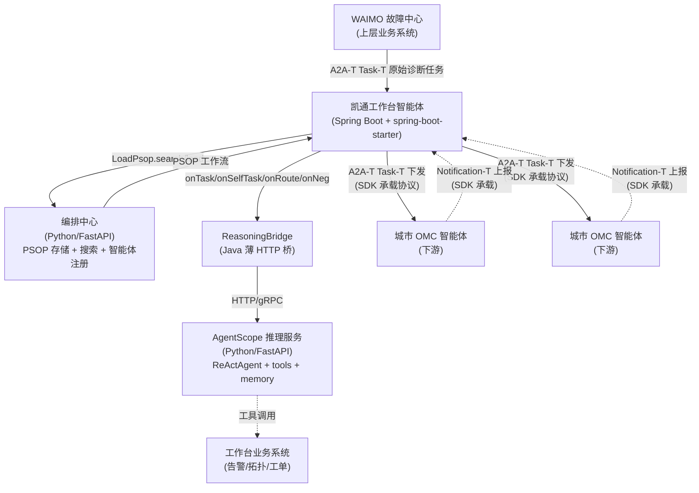
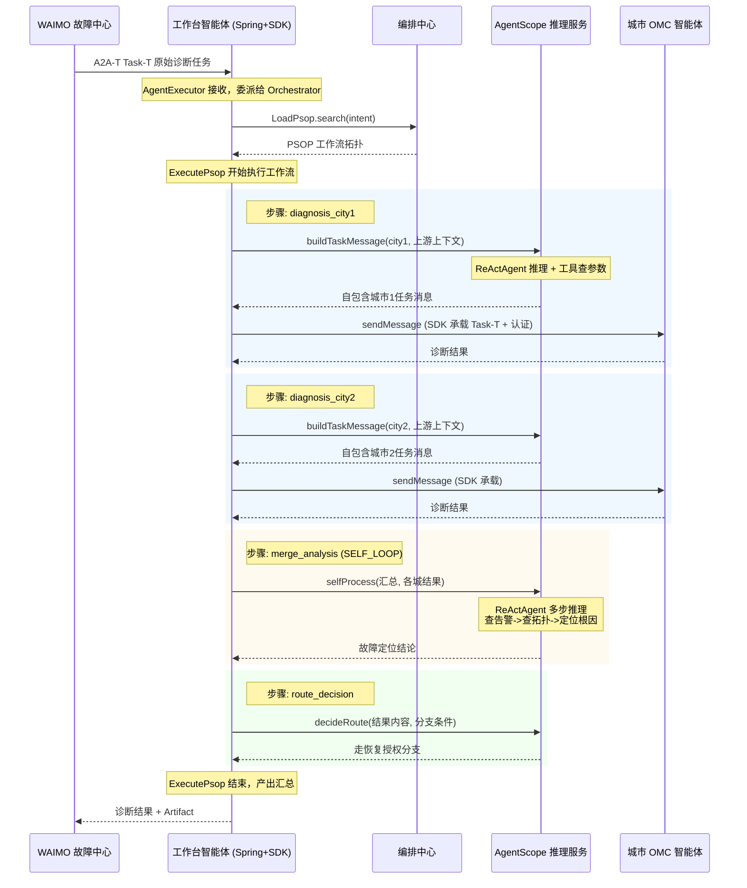
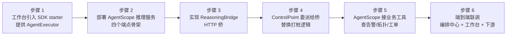

# A2A-T 执行引擎 SDK 与 AgentScope 结合方案

> 面向中国移动凯通工作台团队。说明 A2A-T 执行引擎 SDK（a2at-engine-java）与阿里开源 AgentScope 框架如何在凯通工作台 Agent 化改造中协同定位、划分职责、落地结合，发挥各自最大作用。本文档供双方对方案使用。

---

## 1. 背景与目标

### 1.1 现状

凯通工作台当前为传统 Spring Java 微服务，承载广东传输工作台智能体的业务逻辑。业务复杂度高，当前 SDK demo 中的工作台智能体（`WorkbenchControlPoint`）为打桩实现。

工作台团队计划从传统 Spring 微服务做 Agent 化改造，跟上行业趋势，拟采用阿里开源的 AgentScope 框架。

### 1.2 目标

- 工作台集成 A2A-T 执行引擎 SDK，通过编排中心编排，调度各个智能体
- 业务逻辑交还给工作台自己，但用 AgentScope 承载复杂业务决策
- SDK 与 AgentScope 各司其长，不产生职责重叠或编排引擎冲突

### 1.3 本文回答的问题

SDK 和 AgentScope 怎么结合才能发挥最大作用？边界在哪里？具体怎么落地？

---

## 2. 核心判断：两个框架在不同层，互补而非竞争

A2A-T 执行引擎 SDK 和 AgentScope 解决的是完全不同层次的问题：

| 维度 | A2A-T 执行引擎 SDK | AgentScope |
|------|-------------------|------------|
| 解决的问题 | 智能体**之间**怎么协作 | 单个智能体**内部**怎么思考 |
| 层次定位 | 跨组织编排层 + A2A-T 标准协议层 | 智能体内部智能层（推理 + 工具 + 记忆） |
| 回答的问题 | 谁、什么时候、调哪个智能体 | 拿到任务后怎么想、怎么做、调什么工具 |
| 协议合规 | A2A-T 四类扩展全量承载 | 不涉及跨组织协议 |
| 工作流拓扑 | PSOP 工作流（来自编排中心）驱动 DAG 遍历 | 不持有跨智能体工作流拓扑 |
| 技术栈 | Java（Spring Boot starter） | Python（社区生态） |

**结论：两者是互补关系，不是替代关系。** AgentScope 管的是每个智能体大脑内部的推理循环；SDK 管的是智能体之间怎么按照标准协议和工作流协作。结合点在 SDK 的 `ControlPoint` 接口。

---

## 3. SDK 架构现状速览

### 3.1 三个 Maven 模块

| 模块 | 作用 | 工作台是否需要实现 |
|------|------|------------------|
| `workflow-engine` | 核心 SDK：客户端、工作流执行、控制点、模型 | 否，直接引用 |
| `spring-boot-starter` | Spring Boot 自动配置，暴露 A2A-T 服务端端点 | 只需提供 `@Component AgentExecutor` |
| `samples` | demo（打桩工作台 + 城市 OMC 智能体） | 参考用，不集成 |

### 3.2 核心 API 表面

```
编排中心 (Python/FastAPI)
  |  PSOP 工作流存储 + 搜索 API
  v
LoadPsop.search() / load()          <- 从编排中心搜索 + 加载工作流
  |
ExecutePsop.builder()               <- 高层工作流执行器（加载->执行->事件->持久化）
  .psop(workflow)
  .agentCards(cards)
  .controlPoint(cp)                 <- 工作台业务决策回调（AgentScope 插入点）
  .engineClient(client)
  .execute()
  |
  +- WorkflowEngineClient           <- 出站发送门面（Task-T + 协商循环 + 认证）
  |    +- sendMessage(agent, msg)
  |
  +- ExtensionSender                <- 前置预定位门面（Authorization-T / Notification-T）
  |    +- prePosition()
  |
  +- A2ATransport                   <- 底层传输（共享，两门面复用）
```

### 3.3 工作台需要实现的三个组件

| 组件 | 接口/类 | 职责 | 是否 AgentScope 插入点 |
|------|--------|------|---------------------|
| AgentExecutor | `org.a2aproject.sdk.server.agentexecution.AgentExecutor` | A2A 服务端入口，接收 Task-T | 入站入口，可委派 |
| ControlPoint | `dev.openan.workflow.engine.control.ControlPoint` | 工作流决策回调（4 个方法） | **是，主要插入点** |

### 3.4 A2A-T 四类扩展的承载划分

| A2A-T 扩展 | 业务含义 | 发起方 | 时机 | SDK 承载 | 工作台实现 |
|-----------|---------|--------|------|---------|-----------|
| Task-T | 下发诊断任务 | 工作台 -> OMC | 工作流执行中 | `WorkflowEngineClient` | 任务内容（onTask） |
| Negotiation-T | 参数补充协商 | OMC <-> 工作台 | OMC 发现缺参数时反向发起 | SDK 自动循环 | 补传内容（onNegotiation） |
| Authorization-T | 抢通授权 | 工作台 -> OMC | 工作流启动前预定位 | `ExtensionSender` | 授权策略描述 |
| Notification-T | 抢通结果订阅/上报 | 工作台 -> OMC | 工作流启动前订阅 | `ExtensionSender` | 订阅主题描述 |

**设计原则：协议机制由 SDK 承担，业务决策由工作台实现。** AgentScope 只替换"业务决策"列，不碰"SDK 承载"列。

---

## 4. ControlPoint 四回调：AgentScope 插入点详解

`ControlPoint` 是 SDK 的业务决策接口，也是 AgentScope 唯一需要插入的地方。四个方法当前在 demo 中全部打桩，正是工作台复杂业务逻辑应该由 AgentScope 承载的位置。

### 4.1 onTask —— 任务下发决策

```java
CompletableFuture<TaskResponse> onTask(TaskRequest request, WorkflowEngineClient engineClient);
```

**demo 现状（打桩）：** `buildTargetedTaskMessage(step)` 根据 step 名硬编码返回城市任务模板字符串，`buildCity1Task()` / `buildCity2Task()` 写死故障参数。

**问题：** 真实场景下上游输入是自然语言（"上海-广州 SPN 专线 down，光功率异常"），参数不固定、城市不固定、故障类型不固定。硬编码模板无法覆盖。

**AgentScope 替换后：**
- ReActAgent 接收上游全文上下文
- 推理：从自然语言中提取目标智能体城市、故障类型、相关参数
- 调用工具：查工作台业务系统确认端口状态、告警历史
- 生成只含目标智能体相关参数的自包含任务消息（不混入其他城市信息）
- 工作台 `onTask` 拿到 AgentScope 生成的消息，调 `engineClient.sendMessage()` 发出

**SDK 仍承担：** Task-T 提示词结构化生成、协商自动循环、认证、扩展头注入。`sendMessage` 之后全部是协议机制。

### 4.2 onSelfTask —— 本地自处理决策

```java
CompletableFuture<TaskResponse> onSelfTask(TaskRequest request);
```

**demo 现状（打桩）：** `analyzeFaultLocation()` 关键词匹配 + `LlmHelper.text()` 单轮 LLM 调用，做故障定位汇总。

**问题：** 真实故障分析需要多步推理（查告警 -> 查拓扑 -> 判断故障类型 -> 定位根因），单轮 LLM 不够，且无法跨任务累积记忆。

**AgentScope 替换后：**
- ReActAgent 多步推理循环：推理 -> 调 OMC API 工具 -> 观察结果 -> 再推理
- 可调用真实业务工具：查告警系统、查网络拓扑、查历史工单
- 记忆组件：同一客户、同一专线的历次故障可累积，形成故障画像
- 输出：结构化故障定位结论

**注意：** `onSelfTask` 是 SELF_LOOP 步，不经过 A2A-T 协议（不传 engineClient）。AgentScope 在这里纯做内部推理，SDK 不介入。

### 4.3 onRoute —— 分支路由决策

```java
CompletableFuture<RouteDecision> onRoute(String stepName, Map<String,Object> results, List<JumpCondition> conditions);
```

**demo 现状（打桩）：** 直接 `super.onRoute()` 走默认——取第一个非终端分支。

**问题：** 默认路由只看分支列表顺序，不看上游各智能体返回的实际内容。真实场景需要根据"城市1 诊断出端口故障"还是"城市2 无异常"来决定是否走恢复授权分支。

**AgentScope 替换后：**
- ReActAgent 读取上游各步的返回结果内容（`results` map）
- 语义理解：哪些城市有故障、故障类型、严重程度
- 决策：返回 `RouteDecision.nextStep` 指向正确的下一步
- 可调工具：查故障知识库判断是否需要抢通授权

### 4.4 onNegotiation —— 参数补充协商

```java
CompletableFuture<String> onNegotiation(String agentName, String negotiationText, Map<String,Object> receiveResult);
```

**demo 现状（打桩）：** `NegotiationStrategy.resolve()` 模板化回复。

**问题：** 下游智能体（OMC）返回 INPUT_REQUIRED 说"缺少端口编号"，工作台应该去业务系统查到端口编号再补传，而不是模板回复。

**AgentScope 替换后：**
- ReActAgent 解析下游智能体缺什么参数
- 调工具：去工作台业务系统查缺失的参数
- 生成精准补传内容
- SDK 自动将补传内容作为 follow-up 重发给下游智能体（工作台不碰重发逻辑）

### 4.5 汇总

| 回调 | demo 打桩方式 | AgentScope 替换价值 | SDK 仍承担 |
|------|-------------|-------------------|-----------|
| onTask | 硬编码城市任务模板 | 动态提取参数 + 工具校验 + 自包含消息生成 | Task-T 协议 + sendMessage |
| onSelfTask | 关键词匹配 + 单轮 LLM | 多步推理 + 真实工具 + 跨任务记忆 | 不介入（SELF_LOOP 无 A2A-T） |
| onRoute | 走默认顺序 | 语义理解结果内容 + 智能分支选择 | DAG 遍历 + 状态管理 |
| onNegotiation | 模板回复 | 解析缺参 + 工具取参 + 精准补传 | follow-up 自动重发 |

---

## 5. 推荐结合架构

### 5.1 架构全景



### 5.2 数据流（以 SPN 跨城诊断为例）



### 5.3 职责分配总表

| 职责 | 承载方 | 说明 |
|------|--------|------|
| A2A-T 协议合规（四类扩展） | **SDK** | 工作台不碰协议机制 |
| PSOP 工作流拓扑存储与搜索 | **编排中心** | 工作流定义不在工作台或 AgentScope |
| 工作流 DAG 遍历与状态管理 | **SDK（ExecutePsop / WorkflowExecutor）** | 谁先谁后由 PSOP 驱动 |
| Task-T 消息收发 + SSE 流式 | **SDK** | 工作台只提供消息内容 |
| Agent 认证（Bearer 令牌） | **SDK** | 工作台提供 credentials.json |
| 前置预定位（Authorization-T / Notification-T） | **SDK（ExtensionSender）** | 工作台提供策略描述 |
| 任务消息内容生成 | **AgentScope** | 动态、上下文感知，替代打桩模板 |
| 本地自处理（汇总/分析） | **AgentScope** | 多步推理 + 工具 + 记忆 |
| 分支路由决策 | **AgentScope** | 语义理解结果内容后决策 |
| 参数补充协商内容 | **AgentScope** | 解析缺参 + 工具取参 |
| 业务工具调用（查告警/拓扑/工单） | **AgentScope** | AgentScope 工具集对接工作台业务系统 |
| Spring Boot 服务容器 | **工作台（spring-boot-starter）** | 只需一个 @Component AgentExecutor |

---

## 6. 接缝设计：ReasoningBridge

### 6.1 设计原则

- 接缝在 Java 侧（工作台 ControlPoint 实现），保持 Spring 管理
- AgentScope 是独立 Python 服务，通过 HTTP 调用，语言无关
- ControlPoint 每个方法体尽量只做"调桥 -> 拿结果 -> 塞回 SDK"，不含业务逻辑
- 桥接口稳定，AgentScope 侧实现可独立演进

### 6.2 Java 侧接口定义

```java
package com.kaitong.workbench.bridge;

import java.util.List;
import java.util.Map;
import java.util.concurrent.CompletableFuture;

/**
 * 工作台业务决策桥：将 ControlPoint 四个回调代理给 AgentScope 推理服务。
 * 工作台只实现这一个接口的 HTTP 客户端，ControlPoint 实现里每个方法体一行调用。
 */
public interface ReasoningBridge {

    /**
     * onTask 决策：根据上游上下文，为目标智能体生成自包含任务消息。
     * 返回值直接传给 engineClient.sendMessage()。
     */
    CompletableFuture<String> buildTaskMessage(
            String stepName,
            String agentName,
            String upstreamContext,
            Map<String, Object> params);

    /**
     * onSelfTask 决策：本地多步推理（汇总/分析/定位）。
     * 不经过 A2A-T，纯 AgentScope 内部推理。
     */
    CompletableFuture<String> selfProcess(
            String stepName,
            String message,
            Map<String, Object> priorStepResults);

    /**
     * onRoute 决策：根据上游各步返回内容，选择下一步分支。
     * 返回 nextStep 名称。
     */
    CompletableFuture<String> decideRoute(
            String stepName,
            Map<String, Object> results,
            List<Map<String, Object>> candidateBranches);

    /**
     * onNegotiation 决策：下游智能体缺参数时，解析缺什么 + 工具取参 + 生成补传内容。
     * SDK 负责将返回值作为 follow-up 自动重发，工作台不碰重发。
     */
    CompletableFuture<String> negotiate(
            String agentName,
            String negotiationText,
            Map<String, Object> receiveResult);
}
```

### 6.3 ControlPoint 实现（工作台侧）

```java
package com.kaitong.workbench.control;

import dev.openan.workflow.engine.client.WorkflowEngineClient;
import dev.openan.workflow.engine.control.DefaultControlPoint;
import dev.openan.workflow.engine.model.JumpCondition;
import dev.openan.workflow.engine.model.RouteDecision;
import dev.openan.workflow.engine.model.TaskRequest;
import dev.openan.workflow.engine.model.TaskResponse;
import com.kaitong.workbench.bridge.ReasoningBridge;

import java.util.List;
import java.util.Map;
import java.util.concurrent.CompletableFuture;

/**
 * 工作台 ControlPoint：四个方法各一行调桥，业务逻辑全在 AgentScope 侧。
 * SDK 承担 sendMessage 之后的全部协议机制（Task-T 提示词、协商循环、认证）。
 */
public class KaitongControlPoint extends DefaultControlPoint {

    private final ReasoningBridge bridge;

    public KaitongControlPoint(ReasoningBridge bridge) {
        this.bridge = bridge;
    }

    @Override
    public CompletableFuture<TaskResponse> onTask(
            TaskRequest request, WorkflowEngineClient engineClient) {
        return bridge
                .buildTaskMessage(
                        request.getStepName(),
                        request.getAgentName(),
                        request.getMessage(),
                        request.getParams())
                .thenCompose(msg -> engineClient.sendMessage(request.getAgentName(), msg))
                .thenApply(
                        r ->
                                TaskResponse.builder()
                                        .success(r.getText() != null && !r.getText().isEmpty())
                                        .output(r.getText())
                                        .build())
                .exceptionally(
                        e ->
                                TaskResponse.builder()
                                        .success(false)
                                        .error("Agent call failed: " + e.getMessage())
                                        .build());
    }

    @Override
    public CompletableFuture<TaskResponse> onSelfTask(TaskRequest request) {
        return bridge
                .selfProcess(request.getStepName(), request.getMessage(), request.getParams())
                .thenApply(out -> TaskResponse.builder().success(true).output(out).build());
    }

    @Override
    public CompletableFuture<RouteDecision> onRoute(
            String stepName, Map<String, Object> results, List<JumpCondition> conditions) {
        return bridge
                .decideRoute(stepName, results, conditionsToMaps(conditions))
                .thenApply(
                        next ->
                                RouteDecision.builder()
                                        .nextStep(next)
                                        .reason("AgentScope decided: " + next)
                                        .build());
    }

    @Override
    public CompletableFuture<String> onNegotiation(
            String agentName, String negotiationText, Map<String, Object> receiveResult) {
        return bridge.negotiate(agentName, negotiationText, receiveResult);
    }

    private List<Map<String, Object>> conditionsToMaps(List<JumpCondition> conditions) {
        return conditions.stream()
                .map(c -> Map.of("step", (Object) c.getStep(), "condition", (Object) c.getCondition()))
                .toList();
    }
}
```

### 6.4 HTTP 桥实现（工作台侧）

```java
package com.kaitong.workbench.bridge;

import com.fasterxml.jackson.databind.ObjectMapper;
import java.net.URI;
import java.net.http.HttpClient;
import java.net.http.HttpRequest;
import java.net.http.HttpResponse;
import java.time.Duration;
import java.util.*;
import java.util.concurrent.CompletableFuture;

/**
 * ReasoningBridge 的 HTTP 实现，调用 AgentScope Python 服务。
 * AgentScope 服务地址通过配置注入（如 a2a.reasoning-url）。
 */
public class HttpReasoningBridge implements ReasoningBridge {

    private static final ObjectMapper MAPPER = new ObjectMapper();
    private final HttpClient client;
    private final String baseUrl;

    public HttpReasoningBridge(String baseUrl) {
        this.baseUrl = baseUrl;
        this.client =
                HttpClient.newBuilder()
                        .connectTimeout(Duration.ofSeconds(10))
                        .build();
    }

    @Override
    public CompletableFuture<String> buildTaskMessage(
            String stepName, String agentName, String upstreamContext, Map<String, Object> params) {
        return post(
                "/reasoning/build-task",
                Map.of(
                        "step", stepName,
                        "agent", agentName,
                        "context", upstreamContext,
                        "params", params));
    }

    @Override
    public CompletableFuture<String> selfProcess(
            String stepName, String message, Map<String, Object> priorStepResults) {
        return post(
                "/reasoning/self-process",
                Map.of(
                        "step", stepName,
                        "message", message,
                        "prior_results", priorStepResults));
    }

    @Override
    public CompletableFuture<String> decideRoute(
            String stepName, Map<String, Object> results, List<Map<String, Object>> branches) {
        return post(
                "/reasoning/decide-route",
                Map.of(
                        "step", stepName,
                        "results", results,
                        "branches", branches));
    }

    @Override
    public CompletableFuture<String> negotiate(
            String agentName, String negotiationText, Map<String, Object> receiveResult) {
        return post(
                "/reasoning/negotiate",
                Map.of(
                        "agent", agentName,
                        "concern", negotiationText,
                        "receive_result", receiveResult));
    }

    private CompletableFuture<String> post(String path, Map<String, Object> body) {
        return CompletableFuture.supplyAsync(
                () -> {
                    try {
                        String json = MAPPER.writeValueAsString(body);
                        HttpRequest req =
                                HttpRequest.newBuilder()
                                        .uri(URI.create(baseUrl + path))
                                        .header("Content-Type", "application/json")
                                        .POST(HttpRequest.BodyPublishers.ofString(json))
                                        .build();
                        HttpResponse<String> resp =
                                client.send(req, HttpResponse.BodyHandlers.ofString());
                        if (resp.statusCode() != 200) {
                            throw new RuntimeException(
                                    "AgentScope service returned " + resp.statusCode());
                        }
                        @SuppressWarnings("unchecked")
                        Map<String, Object> result = MAPPER.readValue(resp.body(), Map.class);
                        return (String) result.get("result");
                    } catch (Exception e) {
                        throw new RuntimeException("Reasoning bridge call failed: " + e.getMessage(), e);
                    }
                });
    }
}
```

### 6.5 AgentScope 侧服务骨架（Python）

```python
# kaitong_reasoning_service.py
# AgentScope 推理服务：四个端点对应 ControlPoint 四个回调。
# 每个端点用 ReActAgent 做推理，可调用工作台业务系统工具。

from fastapi import FastAPI
from pydantic import BaseModel

app = FastAPI(title="Kaitong Workbench Reasoning Service")

# 初始化 LLM + Agent（按 AgentScope 最新文档配置）
# agent = ReActAgent(
#     name="kaitong_workbench",
#     model=...,
#     tools=[
#         Tool(query_alarm),      # 对接工作台告警系统
#         Tool(query_topology),    # 对接工作台拓扑系统
#         Tool(query_work_order),  # 对接工作台工单系统
#     ],
# )


class BuildTaskRequest(BaseModel):
    step: str
    agent: str
    context: str
    params: dict


@app.post("/reasoning/build-task")
async def build_task(req: BuildTaskRequest):
    """onTask 决策：从上游上下文提取目标智能体相关参数，生成自包含任务消息。"""
    prompt = (
        f"上游诊断任务：{req.context}\n"
        f"目标智能体：{req.agent}\n"
        f"请提取与该智能体相关的故障参数，"
        f"生成只包含该智能体所需信息的自包含任务消息。用中文。"
    )
    result = agent(prompt)
    return {"result": result.text}


class SelfProcessRequest(BaseModel):
    step: str
    message: str
    prior_results: dict


@app.post("/reasoning/self-process")
async def self_process(req: SelfProcessRequest):
    """onSelfTask 决策：多步推理做故障定位汇总，可调工具查告警/拓扑。"""
    prompt = (
        f"各城市诊断结果：{req.prior_results}\n"
        f"上游任务：{req.message}\n"
        f"请汇总分析，定位故障城市和根因。"
    )
    result = agent(prompt)
    return {"result": result.text}


class DecideRouteRequest(BaseModel):
    step: str
    results: dict
    branches: list


@app.post("/reasoning/decide-route")
async def decide_route(req: DecideRouteRequest):
    """onRoute 决策：根据上游结果内容语义选择下一步分支。"""
    prompt = (
        f"上游各步返回：{req.results}\n"
        f"候选分支：{req.branches}\n"
        f"请选择最合适的下一步分支，只返回分支名称。"
    )
    result = agent(prompt)
    return {"result": result.text.strip()}


class NegotiateRequest(BaseModel):
    agent: str
    concern: str
    receive_result: dict


@app.post("/reasoning/negotiate")
async def negotiate(req: NegotiateRequest):
    """onNegotiation 决策：解析下游缺什么参数，调工具取参，生成补传内容。"""
    prompt = (
        f"下游智能体 {req.agent} 返回参数不足：{req.concern}\n"
        f"已有结果：{req.receive_result}\n"
        f"请查询缺失参数并生成补传内容。用中文。"
    )
    result = agent(prompt)
    return {"result": result.text}
```

> 注意：上方 AgentScope 代码为骨架示意，展示端点与 ControlPoint 回调的对应关系。AgentScope 的具体 API（ReActAgent、Tool、Model 的构造方式）请以 AgentScope 官方最新文档为准。

---

## 7. 边界与反模式

### 7.1 核心边界：不要让 AgentScope 重复 PSOP 工作流

AgentScope 自带多智能体协作模式（pipeline、sequential、parallel 等）。**如果工作台用 AgentScope 的编排去重新实现"先调城市1、再调城市2、再汇总"这个流程，就会和 SDK 的 `WorkflowExecutor` + 编排中心的 PSOP 形成两个编排引擎打架。**

| 编排层 | 归属 | 编排什么 |
|--------|------|---------|
| 智能体**之间**的编排 | SDK + PSOP（编排中心） | 谁调谁、什么顺序、什么条件跳转 |
| 智能体**内部**的编排 | AgentScope | ReAct 循环、工具调用顺序、子任务分解 |

这条线必须跟工作台团队讲清楚：**AgentScope 的多智能体编排模式不要用于跨智能体流程，跨智能体流程由 PSOP 工作流定义、SDK 执行。**

### 7.2 其他注意事项

| 事项 | 说明 |
|------|------|
| 不要在 onRoute 里发消息 | `onRoute` 只返回分支决策，不发 A2A-T 消息。发消息是 `onTask` 的职责 |
| 不要在 onNegotiation 里发消息 | `onNegotiation` 只返回补传文本，SDK 自动重发 follow-up。工作台不碰重发 |
| SELF_LOOP 步不经过 A2A-T | `onSelfTask` 不传 engineClient，AgentScope 纯内部推理 |
| AgentScope 服务要独立部署 | 不要嵌入 Spring Boot 进程，保持语言无关、独立扩缩容 |
| 工作流拓扑改动只改 PSOP | 业务流程变化（加步骤、改顺序）去编排中心改 PSOP，不改 AgentScope 代码 |
| AgentScope 工具对接工作台业务系统 | 工具（查告警/拓扑/工单）是工作台自己的业务系统，AgentScope 服务通过 API 调用 |

---

## 8. 落地路线

### 8.1 分步实施



| 步骤 | 工作台做 | SDK 侧 |
|------|---------|--------|
| 1. 引入 starter | Maven 依赖 `spring-boot-starter`，写 `@Component AgentExecutor` | 提供 starter + autoconfig |
| 2. 部署 AgentScope | 起 Python FastAPI 服务，四个端点骨架（可先返回固定文本） | 不涉及 |
| 3. 实现桥 | 写 `HttpReasoningBridge`，配置 `a2a.reasoning-url` | 不涉及 |
| 4. 委派 ControlPoint | `KaitongControlPoint` 四方法委派给桥 | 提供 ControlPoint 接口 + DefaultControlPoint |
| 5. 接业务工具 | AgentScope 工具对接告警/拓扑/工单系统 | 不涉及 |
| 6. 端到端联调 | 编排中心搜 PSOP -> 工作台执行 -> 下游 OMC 响应 | 提供 ExecutePsop + LoadPsop |

### 8.2 可选：下游智能体也 Agent 化

如果城市 OMC 智能体也要 Agent 化（从传统服务改为智能体），同理：
- AgentScope 做内部推理（诊断逻辑）
- 用 SDK 的 server starter（或 Python SDK）暴露 A2A-T 接口
- 工作台通过 SDK 的 `sendMessage` 调用它们，协议透明

### 8.3 编排中心侧

- PSOP 工作流定义工作台的跨智能体流程拓扑（步骤、顺序、条件、智能体分配）
- 编排中心负责 PSOP 存储 + 意图搜索
- 工作台通过 `LoadPsop.search` + `LoadPsop.load` 获取工作流
- 工作流变更只需改编排中心的 PSOP，不改代码

---

## 9. 总结

| 问题 | 答案 |
|------|------|
| SDK 和 AgentScope 谁管什么 | SDK 管智能体之间的协议和编排；AgentScope 管智能体内部的推理 |
| 结合点在哪 | SDK 的 `ControlPoint` 接口四个回调 |
| 怎么跨语言 | Java 侧薄 HTTP 桥（ReasoningBridge），AgentScope 独立 Python 服务 |
| 怎么避免冲突 | AgentScope 不做跨智能体编排（那是 PSOP + SDK 的职责） |
| 工作台要改多少 | 一个 `@Component AgentExecutor` + 一个 `ControlPoint` 实现 + 一个 HTTP 桥，业务逻辑全在 AgentScope 侧 |

**一句话：SDK 做壳（协议 + 工作流），AgentScope 做脑（推理 + 工具 + 记忆），ControlPoint 是壳和脑之间的接缝。**
