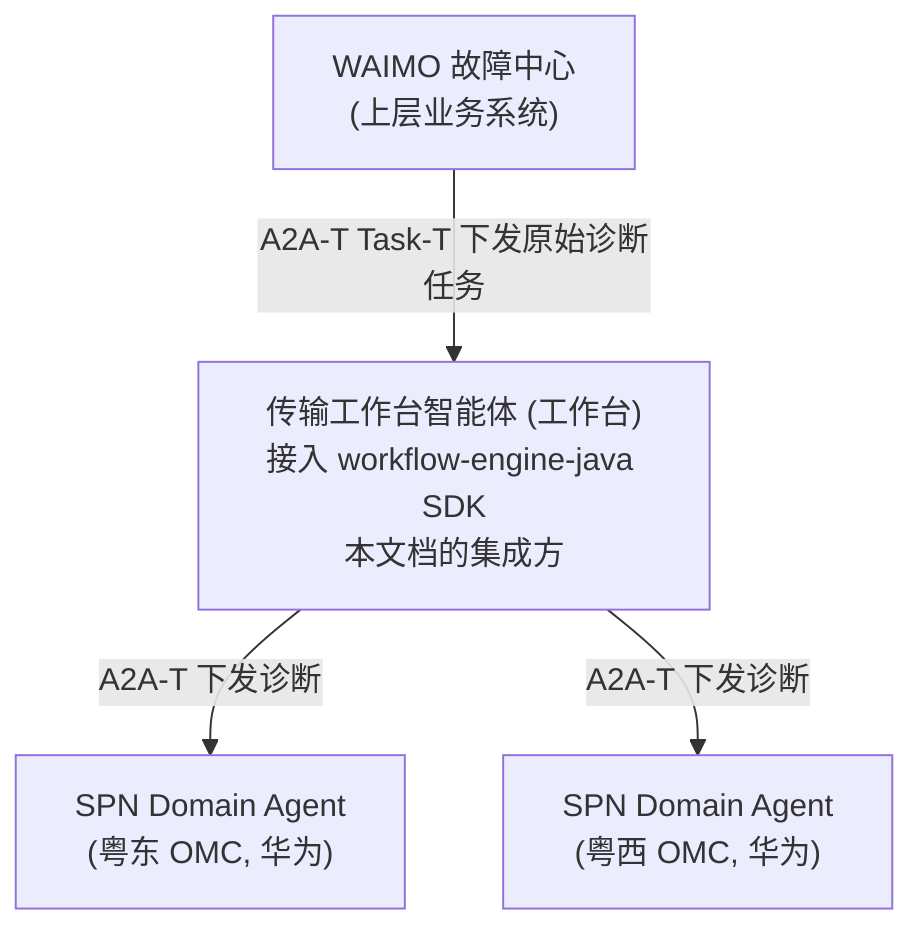
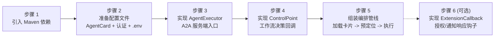
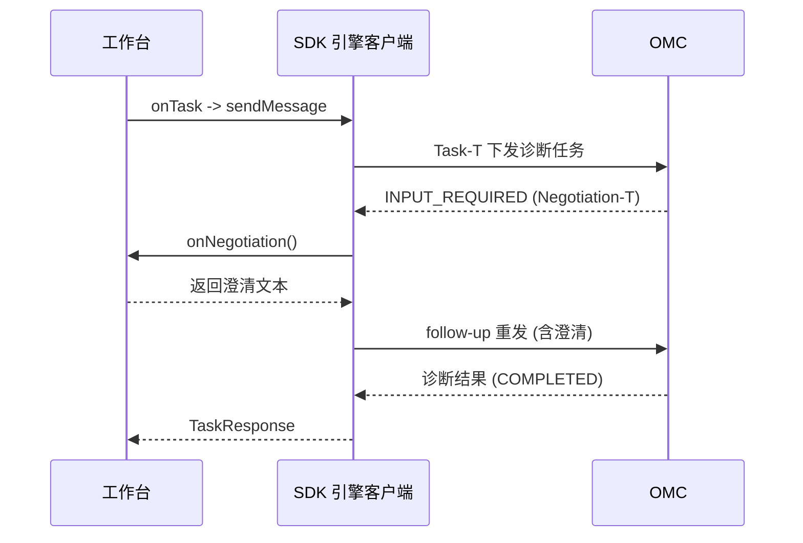
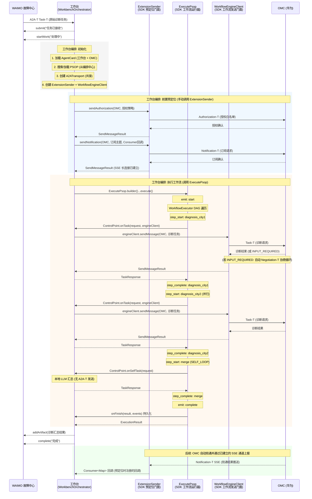

# 编排中心工作流执行引擎 SDK 工作台集成指南

> 面向广东移动传输工作台智能体研发团队。本文档以 SPN 专线故障跨城协同诊断联创场景为例，从工作台视角说明接入Workflow执行引擎 SDK 的完整路径。读者拿到本文档后，可端到端完成集成。

---

## 1. 场景全景

### 1.1 业务拓扑



工作台是编排方。它接收 WAIMO 故障中心通过 A2A-T 下发的原始诊断任务，编排下游多地市 SPN Domain Agent (华为 OMC) 执行故障根因诊断，汇总结果并上报。

### 1.2 四类 A2A-T 交互

SDK 在该场景中承载四类 A2A-T 交互，对应业务流文档的四个接口:

| 序号 | A2A-T 扩展 | 业务含义 | 发起方 | 时机 |
|------|-----------|---------|--------|------|
| 1 | Task-T | 下发诊断任务 | 工作台 -> OMC | 工作流执行中 |
| 2 | Negotiation-T | 参数修正协商 | OMC <-> 工作台 | OMC 发现参数缺失时反向发起 |
| 3 | Authorization-T | 抢通授权 | 工作台 -> OMC | 工作流启动前，前置预定位 |
| 4 | Notification-T | 抢通结果订阅/上报 | 工作台 -> OMC (订阅) / OMC -> 工作台 (SSE 上报) | 工作流启动前订阅，执行中上报 |

序号 1、2 在工作流执行过程中发生，由 SDK 的 `WorkflowEngineClient` 承载。序号 3、4 是前置动作，在工作流启动前完成，由 SDK 的 `ExtensionSender` 承载。这两条路径共享同一个底层传输层 `A2ATransport`，职责隔离。

### 1.3 SDK 自动处理 vs 工作台实现

引擎的设计原则是: **协议机制由 SDK 承担，业务决策由工作台实现**。

| SDK 自动处理 | 工作台实现 |
|-------------|-----------|
| A2A 消息收发、SSE 流式传输、事件提取 | 是否发送任务、发送什么内容 |
| Agent 认证 (Bearer 令牌获取/刷新) | 凭证配置 (credentials.json) 或自定义 AuthProvider |
| Task-T 结构化提示词生成 (调用 A2A-T SDK) | 诊断任务的原始自然语言输入 |
| Negotiation-T 自动协商循环 (重发 follow-up) | 协商澄清内容 (onNegotiation 返回) |
| Authorization-T / Notification-T 报文构造 | 授权策略描述、订阅主题描述 |
| DAG 遍历、上下文组装、状态管理 | 分支路由决策 (onRoute 返回) |
| 事件全量产出 (EventType) | 事件处理 (EventCallback) |

---

## 2. 集成全景图

工作台集成 SDK 共需完成六步。先总后分，每步后续均有详细说明和代码示例。



职责分布:

| 组件 | 工作台实现 | SDK 提供 | 说明 |
|------|-----------|---------|------|
| `AgentExecutor` | 是 | 否 | 工作台的 A2A 服务端入口，接收 WAIMO 下发的任务 |
| `ControlPoint` | 是 (4 个方法) | 接口 + 默认实现 | 工作流决策: 任务下发、自处理、路由、协商 |
| `AuthProvider` | 是 (可选) | 接口 | 自定义认证头注入 (企业 SSO 等)，与 credentials.json 二选一或组合 |
| `ExtensionCallback` | 是 (2 个方法，可选) | 接口 + 默认实现 | 响应 OMC 推送的授权请求/通知 (预留，当前版本未触发) |
| `WorkbenchOrchestrator` | 是 | 否 | 组装编排管线的业务类 |
| `WorkflowEngineClient` | 否 | 是 | 工作流发送门面 (Task-T + 协商循环) |
| `ExtensionSender` | 否 | 是 | 前置预定位门面 (授权 + 订阅) |
| `A2ATransport` | 否 | 是 | 共享传输层 (HTTP + 认证 + SSE) |
| `ExecutePsop` | 否 | 是 | 高层运行器 (生命周期 + 事件 + 持久化) |

---

## 3. 逐步集成

### 步骤 1: 引入 Maven 依赖

工作台项目 `pom.xml` 中添加:

```xml
<dependency>
    <groupId>dev.openan.workflow.sdk</groupId>
    <artifactId>engine-sdk</artifactId>
    <version>1.0.0</version>
</dependency>
```

如果工作台基于 Spring Boot 且需要 SDK 自动装配 A2A 服务端 (AgentCard 加载、REST 控制器、事件总线):

```xml
<dependency>
    <groupId>dev.openan.workflow.sdk</groupId>
    <artifactId>engine-sdk-spring-boot-starter</artifactId>
    <version>1.0.0</version>
</dependency>
```

Spring Boot starter 会自动注册 `AgentCard`、`RequestHandler`、`RestHandler`、`A2AController` 等 Bean。工作台只需提供一个 `AgentExecutor` 实现类标注 `@Component` 即可。

### 步骤 2: 准备配置文件

集成需要三类配置文件。

#### 2.1 AgentCard (工作台自身的)

工作台作为 A2A 服务端，需要声明自己的 AgentCard。该文件告知 WAIMO 故障中心如何调用工作台:

```json
{
  "name": "Transport Workbench Agent",
  "description": "传输工作台智能体: 接收上层诊断任务，编排多地市 OMC 执行诊断并汇总",
  "version": "1.0.0",
  "capabilities": {
    "streaming": true,
    "extensions": [
      {"uri": "https://projects.tmforum.org/a2aproject/telecommunication/extensions/Task-T/v1", "required": false},
      {"uri": "https://projects.tmforum.org/a2aproject/telecommunication/extensions/NEGOTIATION-T", "required": false},
      {"uri": "https://projects.tmforum.org/a2aproject/telecommunication/extensions/Authorization-T/v1", "required": false},
      {"uri": "https://projects.tmforum.org/a2aproject/telecommunication/extensions/Notification-T/v1", "required": false}
    ]
  },
  "skills": [
    {"id": "cross-city-fault-diagnosis", "name": "跨城故障协同诊断"}
  ],
  "supportedInterfaces": [
    {"protocolBinding": "HTTP+JSON", "url": "https://工作台地址/a2a/json"}
  ]
}
```

下游 SPN Domain Agent 的 AgentCard 由华为提供或从注册中心获取。工作台只需加载它们用于 SDK 通信。关键信息是 `name` (SDK 中用此名称寻址) 和 `supportedInterfaces.url` (通信地址)。

#### 2.2 认证配置

SDK 提供两层认证机制，可单独使用或组合使用:

| 认证方式 | 适用场景 | 配置方式 |
|---------|---------|---------|
| Credentials 认证 | Agent 使用标准 Bearer/API Key 认证，有登录接口获取令牌 | 提供 credentials.json 文件 |
| 自定义 AuthProvider | 企业 SSO、非标准认证协议、AgentCard 无 securitySchemes 但仍需认证 | 实现 `AuthProvider` 接口 |

**执行顺序:** 自定义 AuthProvider 先执行，Credentials 认证后执行。两者可同时使用，各自向请求头注入认证信息。

##### 方式一: Credentials 认证 (credentials.json)

SPN Domain Agent (华为 OMC) 使用 Bearer 认证。SDK 的 `AgentAuthManager` 自动调用登录接口获取令牌并缓存刷新，工作台只需提供凭证文件:

```json
{
  "SPN Domain Agent City1": {
    "bearerAuth": {
      "login_url": "https://omc-city1地址/rest/plat/smapp/v1/oauth/token",
      "method": "PUT",
      "request_fields": {
        "grantType": "password",
        "userName": "admin",
        "value": "enc:加密后的密码",
        "ipaddr": "*"
      },
      "token_field": "accessSession",
      "token_ttl": 3600
    }
  },
  "SPN Domain Agent City2": {
    "bearerAuth": {
      "login_url": "https://omc-city2地址/rest/plat/smapp/v1/oauth/token",
      "method": "PUT",
      "request_fields": {
        "grantType": "password",
        "userName": "admin",
        "value": "enc:加密后的密码",
        "ipaddr": "*"
      },
      "token_field": "accessSession",
      "token_ttl": 3600
    }
  }
}
```

键名必须与 AgentCard 的 `name` 字段一致。SDK 依据此键名匹配 AgentCard 与凭证。密码字段 `value` 使用 `enc:` 前缀标识加密内容，SDK 的 `CredentialCrypto` 自动解密 (密钥通过 `A2AT_CRED_KEY` 环境变量注入，32 字节 hex)。

**密码加密方法:**

加密格式为 `enc:<base64-iv>:<base64-ciphertext>`，算法为 AES-256-GCM。SDK 提供两种加密方式:

**方式一: 命令行工具 (推荐)**

```bash
# 1. 生成 32 字节密钥 (仅首次，妥善保存)
openssl rand -hex 32
# 输出示例: a1b2c3d4e5f6a7b8c9d0e1f2a3b4c5d6e7f8a9b0c1d2e3f4a5b6c7d8e9f0a1b2

# 2. 设置密钥环境变量
set A2AT_CRED_KEY=a1b2c3d4e5f6a7b8c9d0e1f2a3b4c5d6e7f8a9b0c1d2e3f4a5b6c7d8e9f0a1b2

# 3. 加密密码 (输出 enc:... 格式，直接复制到 credentials.json)
java -cp engine-sdk.jar com.openan.a2at.engine.client.CredentialCrypto "Admin@123"
# 输出: enc:xxxxxxxxxxxx:yyyyyyyyyyyyyyyyyyyyyyyyyyyyyyyyyyyy

# 也可以将密钥作为第二个参数传入
java -cp engine-sdk.jar com.openan.a2at.engine.client.CredentialCrypto "Admin@123" a1b2c3d4...
```

**方式二: 代码调用**

```java
// 设置密钥后调用
System.setProperty("A2AT_CRED_KEY", "a1b2c3d4e5f6...");
String encrypted = CredentialCrypto.encrypt("Admin@123");
// encrypted = "enc:xxxxxxxxxxxx:yyyyyyyyyyyyyyyyyyyyyyyyyyyyyyyyyyyy"
```

将输出的 `enc:...` 值直接填入 credentials.json 的 `value` 字段:

```json
{
  "request_fields": {
    "value": "enc:xxxxxxxxxxxx:yyyyyyyyyyyyyyyyyyyyyyyyyyyyyyyyyyyy"
  }
}
```

运行时 SDK 从 `A2AT_CRED_KEY` 环境变量读取密钥自动解密。密钥来源优先级: 操作系统环境变量 > Java 系统属性 (由 `.env` 文件加载器设置)。

凭证配置支持的完整字段:

| 字段 | 类型 | 默认值 | 说明 |
|------|------|--------|------|
| `login_url` | String | 必填 | 登录接口地址 |
| `method` | String | `POST` | HTTP 方法 |
| `content_type` | String | `application/json` | 请求 Content-Type |
| `request_fields` | Map | - | 请求体字段 (替代 legacy 的 username/password) |
| `token_field` | String | `accessSession` | 从响应 JSON 提取令牌的路径 (支持点号嵌套，如 `data.access_token`) |
| `token_ttl` | int | 3600 | 令牌缓存有效期 (秒)，到期前 60 秒自动刷新 |
| `auth_header` | String | `Authorization` | 自定义认证头名称 (设置后使用 `CustomAuthInterceptor`) |
| `auth_header_prefix` | String | `Bearer ` | 自定义认证头前缀 (与 `auth_header` 配合使用) |

##### 方式二: 自定义 AuthProvider

当认证机制不属于标准 Bearer/API Key，或令牌来自外部身份提供商 (如企业 SSO) 时，实现 `AuthProvider` 接口:

```java
public interface AuthProvider {
    /**
     * 为发送消息注入认证头。
     *
     * @param agentName 目标 Agent 名称 (匹配 AgentCard.name)
     * @param agentCard Agent 卡片 (securitySchemes 可能为空)
     * @param headers   可变的请求头 Map，直接写入认证信息
     */
    void applyAuth(String agentName, AgentCard agentCard, Map<String, String> headers);
}
```

通过 `WorkflowEngineClientConfig` 注册:

```java
WorkflowEngineClientConfig config = WorkflowEngineClientConfig.builder()
        .authProvider((agentName, agentCard, headers) -> {
            // 从企业 SSO 获取令牌
            String token = ssoClient.getToken(agentName);
            headers.put("Authorization", "Bearer " + token);
        })
        .sslVerify(sslVerify)
        .a2atEnvPath(a2atEnvPath)
        .build();
```

`AuthProvider` 在**每次消息发送时**被调用，无论 AgentCard 是否声明了 `securitySchemes`。典型用途:

- AgentCard 无 `securitySchemes` 但服务端仍要求认证
- 认证机制非 A2A 标准类型 (Bearer、API Key、OAuth2)
- 令牌来自企业统一身份认证平台 (如华为 iMaster SSO)
- 需要注入非标准认证头 (如 `X-Custom-Token`、`X-Request-Signature`)

##### 两种方式组合使用

如果部分 Agent 使用 credentials 认证、部分使用自定义认证，或需要在 credentials 基础上追加额外头:

```java
WorkflowEngineClientConfig config = WorkflowEngineClientConfig.builder()
        .credentialsConfigPath(credentialsPath)    // credentials 认证
        .authProvider((agentName, agentCard, headers) -> {
            // 追加企业级追踪头
            headers.put("X-Trace-Id", TraceContext.current().getTraceId());
        })
        .build();
```

执行顺序: `AuthProvider.applyAuth()` 先执行 -> `AgentAuthManager` 后执行。两者写入同一个 headers Map，互不覆盖。

#### 2.3 A2A-T SDK 环境 (.env)

A2A-T SDK 的 LLM 配置 (用于 Task-T 提示词生成、场景识别等)。最小配置:

```ini
LLM_API_KEY=你的API密钥
LLM_BASE_URL=https://api.example.com/v1
LLM_MODEL=gpt-4o
LLM_LANGUAGE=zh-CN
```

SDK 通过此配置调用 A2A-T SDK 生成 Task-T 结构化提示词。如果此文件未配置或生成失败，SDK 会降级为使用原始输入文本作为消息内容，不阻断流程。

### 步骤 3: 实现 AgentExecutor

工作台作为 A2A 服务端，需要实现 `AgentExecutor` 接口。这是 WAIMO 故障中心调用工作台的入口。SDK 不提供此实现 -- 它是工作台的业务代码。

`AgentExecutor` 来自 A2A Java SDK (`org.a2aproject.sdk.server.agentexecution.AgentExecutor`)。工作台实现 `execute` 方法接收上层任务，实现 `cancel` 方法处理取消。

接口签名:

```java
public interface AgentExecutor {
    void execute(RequestContext ctx, AgentEmitter emitter) throws A2AError;
    void cancel(RequestContext ctx, AgentEmitter emitter) throws A2AError;
}
```

工作台实现示例:

```java
public class TransportWorkbenchExecutor implements AgentExecutor {

    private final String orchUrl;           // 编排中心地址 (PSOP 搜索/加载)
    private final String credentialsPath;    // 凭证配置路径
    private final boolean sslVerify;         // 是否校验 TLS 证书
    private final String a2atEnvPath;        // A2A-T .env 路径

    public TransportWorkbenchExecutor(String orchUrl, String credentialsPath,
                                       boolean sslVerify, String a2atEnvPath) {
        this.orchUrl = orchUrl;
        this.credentialsPath = credentialsPath;
        this.sslVerify = sslVerify;
        this.a2atEnvPath = a2atEnvPath;
    }

    @Override
    public void execute(RequestContext ctx, AgentEmitter emitter) throws A2AError {
        String taskId = ctx.getTaskId();
        String contextId = ctx.getContextId();
        String input = extractText(ctx.getMessage());

        // 1. 向 WAIMO 回报任务已接收 (A2A 状态消息)
        emitter.submit(buildStatusMessage(contextId, taskId, "任务已接收"));
        emitter.startWork(buildStatusMessage(contextId, taskId, "正在处理"));

        try {
            // 2. 委托编排管线执行完整的诊断流程
            String result = new WorkbenchOrchestrator(
                    orchUrl, credentialsPath, sslVerify, a2atEnvPath
            ).run(input);

            // 3. 返回诊断汇总结果 (A2A Artifact)
            List<Part<?>> parts = List.of(new TextPart("跨城故障协同诊断汇总结果"));
            emitter.addArtifact(parts, "result", "cross-city-diagnosis", null, false, true);
            emitter.complete(buildStatusMessage(contextId, taskId, "完成"));
        } catch (Exception e) {
            emitter.fail(buildStatusMessage(contextId, taskId, "失败: " + e.getMessage()));
        }
    }

    @Override
    public void cancel(RequestContext ctx, AgentEmitter emitter) throws A2AError {
        emitter.cancel();
    }

    // --- 工具方法 ---
    private static String extractText(Message message) {
        StringBuilder sb = new StringBuilder();
        for (Part<?> part : message.parts()) {
            if (part instanceof TextPart tp) sb.append(tp.text());
        }
        return sb.toString();
    }

    private static Message buildStatusMessage(String contextId, String taskId, String text) {
        return Message.builder()
                .messageId(UUID.randomUUID().toString())
                .contextId(contextId)
                .taskId(taskId)
                .role(Message.Role.ROLE_AGENT)
                .parts(new TextPart(text))
                .build();
    }
}
```

`AgentEmitter` 的调用时序: `submit` (已接收) -> `startWork` (处理中) -> `addArtifact` (结果) -> `complete` (完成)。这一时序是 A2A 协议的标准消息交互，WAIMO 故障中心据此感知任务进度。

如果使用 Spring Boot starter，只需将此类标注 `@Component`，starter 自动注册到 A2A 服务:

```java
@Component
public class TransportWorkbenchExecutor implements AgentExecutor { ... }
```

### 步骤 4: 实现 ControlPoint

`ControlPoint` 是工作台实现的核心决策接口。SDK 在工作流执行过程中调用这四个方法，工作台决定"做什么"，SDK 负责"怎么发"。

```java
public interface ControlPoint {
    CompletableFuture<TaskResponse> onTask(TaskRequest request, WorkflowEngineClient engineClient);
    default CompletableFuture<TaskResponse> onSelfTask(TaskRequest request) { ... }
    CompletableFuture<RouteDecision> onRoute(String stepName, Map<String, Object> results, List<JumpCondition> conditions);
    default CompletableFuture<String> onNegotiation(String agentName, String negotiationText, Map<String, Object> receiveResult) { ... }
}
```

可以继承 `DefaultControlPoint` (已实现 onSelfTask、onNegotiation 默认逻辑)，只重写需要的方法。下面逐个说明。

#### 4.1 onTask -- 下发诊断任务

SDK 在工作流走到一个需要向下游 Agent 发送任务的步骤时调用此方法。工作台决定发送什么内容给哪个 Agent。

`request` 包含: `agentName` (目标 Agent 名称)、`stepName` (当前步骤名)、`message` (SDK 组装的完整消息，含上游上下文)。

关键设计: 给每个 OMC 发送的任务只包含该 OMC 相关的参数，不混入其他地市的信息。示例中 `buildTargetedTaskMessage` 依据步骤名构造针对性消息:

```java
public class WorkbenchControlPoint extends DefaultControlPoint {

    @Override
    public CompletableFuture<TaskResponse> onTask(
            TaskRequest request, WorkflowEngineClient engineClient) {
        String step = request.getStepName();
        String agentName = request.getAgentName();

        // 依据步骤构造针对性任务消息 (只含该 OMC 相关参数)
        String targetedMessage = buildTargetedTaskMessage(step);

        return engineClient.sendMessage(agentName, targetedMessage)
                .thenApply(r -> {
                    boolean success = r.getText() != null && !r.getText().isEmpty();
                    return TaskResponse.builder()
                            .success(success)
                            .output(r.getText())
                            .build();
                })
                .exceptionally(e -> TaskResponse.builder()
                        .success(false)
                        .error("Agent 调用失败: " + e.getMessage())
                        .build());
    }

    private static String buildTargetedTaskMessage(String step) {
        return switch (step) {
            case "diagnosis_city1" -> """
                ## 任务
                SPN 专线故障诊断 - 粤东 OMC 侧

                ## 故障参数
                - 端口状态: port-7 = DOWN
                - 光功率: -28dBm (阈值 -20dBm)
                - 所属单板: line-card-03
                - 端口号: port-7

                请针对粤东 OMC 侧端口故障进行诊断。""";
            case "diagnosis_city2" -> """
                ## 任务
                SPN 专线故障诊断 - 粤西 OMC 侧

                ## 排查要求
                - 排查粤西 OMC 端口状态是否正常
                - 确认光功率是否在正常范围
                - 确认是否存在异常告警

                请针对粤西 OMC 侧进行排查。""";
            default -> "请执行 SPN 专线故障诊断任务。";
        };
    }
}
```

`engineClient.sendMessage(agentName, message)` 内部自动完成: Task-T 提示词生成 -> Bearer 认证 -> SSE 流式发送 -> 事件提取 -> Negotiation-T 协商循环。工作台只需调用一行。

#### 4.2 onSelfTask -- 本地汇总 (自环节点)

当工作流步骤标记为 `SELF_LOOP` 时，SDK 调用此方法。这意味着该步骤由工作台本地处理，不向下游发送 A2A-T 消息。典型用途: 汇总多个 OMC 的诊断结果。

```java
@Override
public CompletableFuture<TaskResponse> onSelfTask(TaskRequest request) {
    String message = request.getMessage();
    // 工作台本地汇总逻辑 (可调用 LLM 做故障定位结论)
    String fallback = "汇总分析完成。故障定位: 粤东地市 OMC，端口 Down，光功率 -28dBm 低于阈值。";
    String sys = "你是 SPN 跨城故障协同诊断汇总专家。根据两地市 OMC 诊断结果，输出故障定位结论。";
    String result = LlmHelper.text(a2atEnvPath, sys, message, fallback);
    return CompletableFuture.completedFuture(
            TaskResponse.builder().success(true).output(result).build());
}
```

`DefaultControlPoint` 的默认实现是将 `request.message` 原样返回。如果不需要 LLM 汇总，可以不重写此方法。

#### 4.3 onRoute -- 分支路由

当工作流步骤有条件分支时 (即 `next` 列表中 `JumpCondition` 带有非空 `condition`)，SDK 调用此方法。工作台根据已有结果决定走哪个分支。

返回 `RouteDecision`，其 `nextStep` 必须是 `conditions` 中声明的某个步骤名:

```java
@Override
public CompletableFuture<RouteDecision> onRoute(
        String stepName, Map<String, Object> results, List<JumpCondition> conditions) {
    // 简单场景: 取第一个非终止分支
    String nextStep = conditions.get(0).getStep();
    for (JumpCondition jc : conditions) {
        if (!"end".equals(jc.getStep()) && !"retry".equals(jc.getStep())) {
            nextStep = jc.getStep();
            break;
        }
    }
    return CompletableFuture.completedFuture(
            RouteDecision.builder().nextStep(nextStep).reason("默认路由").build());
}
```

路由规则说明:
- 步骤没有 `next` -> 终止步骤，工作流结束。
- `next` 中所有 `condition` 为空 -> 无条件扇出: 并行调度所有下游步骤。
- `next` 中有 `condition` -> 条件分支: 调用 `onRoute`，返回单个目标步骤 (N 选 1)。

复杂场景可使用 LLM 决策路由 (参考编排中心 `DynamicWorkflowEngine._llm_route_decision` 的实现)。

#### 4.4 onNegotiation -- 协商澄清

当 OMC 返回 `INPUT_REQUIRED` (Negotiation-T) 时，SDK 自动进入协商循环。SDK 调用此方法获取澄清文本，然后自动重发给 OMC。工作台只需返回澄清内容，不需要自行发送消息。

触发条件: OMC 发现任务参数有误或缺失 (必选参数缺失、取值不在枚举范围、语义校验错误等)。

```java
@Override
public CompletableFuture<String> onNegotiation(
        String agentName, String negotiationText, Map<String, Object> receiveResult) {
    // negotiationText: OMC 的协商请求内容 (明确指出缺失/错误的参数及修正建议)
    // 返回: 工作台补全或修正后的澄清文本

    String clarification = "客户 A 粤东-粤西间 SPN 专线中断，"
            + "粤东 OMC 告警端口 Down，光功率 -28dBm。"
            + "请根据此上下文修正参数后重新执行诊断。";
    return CompletableFuture.completedFuture(clarification);
}
```

SDK 自动将返回的澄清文本封装为 Negotiation-T follow-up 消息重发给 OMC，最多重试 3 轮 (可配置)。如果 OMC 在 3 轮内收敛 (返回正常结果)，工作流继续。如果未收敛，`sendMessage` 返回的 `SendMessageResult` 中 `taskState` 仍为 `INPUT_REQUIRED`。

协商循环时序:



### 步骤 5: 组装编排管线

这一步将所有组件串联起来。工作台实现一个编排类，在 `AgentExecutor.execute` 被调用时运行完整的诊断流程。

```java
public class WorkbenchOrchestrator {

    private final String orchUrl;
    private final String credentialsPath;
    private final boolean sslVerify;
    private final String a2atEnvPath;

    public String run(String messageText) throws Exception {
        // 1. 加载 AgentCard (工作台自身 + 下游 OMC)
        List<AgentCard> agentCards = loadAgentCards();

        // 2. 搜索 + 加载 PSOP 工作流 (从编排中心)
        String psopId = searchPsop(messageText);
        Workflow workflow = LoadPsop.load(orchUrl, psopId, null, sslVerify);

        // 3. 创建共享传输层 + 两个门面
        A2ATransport transport = new A2ATransport(
                agentCards,
                null,
                WorkflowEngineClientConfig.builder()
                        .sslVerify(sslVerify)
                        .a2atEnvPath(a2atEnvPath)
                        .credentialsConfigPath(credentialsPath)
                        // 如需自定义认证 (企业 SSO 等)，取消注释:
                        // .authProvider((agentName, card, headers) -> {
                        //     headers.put("Authorization", "Bearer " + ssoClient.getToken(agentName));
                        // })
                        .build());
        WorkflowEngineClient engineClient = new DefaultWorkflowEngineClient(transport);
        ExtensionSender extensionSender = new DefaultExtensionSender(transport);

        // 4. 前置预定位: 向每个 OMC 下发授权策略 + 订阅通知
        prePositionExtensions(extensionSender, agentCards);

        // 5. 执行工作流
        WorkbenchControlPoint controlPoint =
                new WorkbenchControlPoint(a2atEnvPath, new NegotiationStrategy(a2atEnvPath));
        ExecutionResult result = ExecutePsop.builder()
                .psop(workflow)
                .agentCards(agentCards)
                .controlPoint(controlPoint)
                .engineClient(engineClient)
                .runtimeIntent(messageText)
                .lang("zh")
                .sslVerify(sslVerify)
                .credentialsConfigPath(credentialsPath)
                .a2atEnvPath(a2atEnvPath)
                .eventCallback(createLogCallback())
                .onFinish((r, events) -> {
                    // 持久化执行记录 (可选)
                    log.info("工作流完成: success={}, 事件数={}", r.isSuccess(), events.size());
                    return CompletableFuture.completedFuture(null);
                })
                .execute()
                .join();

        return buildResultText(result);
    }
}
```

#### 5.1 前置预定位详解

步骤 4 的前置预定位是本场景的关键设计。授权和订阅是单次消息调用，与工作流执行分离:

```java
private void prePositionExtensions(ExtensionSender sender, List<AgentCard> agentCards) {
    for (AgentCard card : agentCards) {
        String name = card.name();
        if (name.contains("Workbench")) continue;  // 跳过工作台自身

        // 授权预定位: 告知 OMC 允许自动执行的业务抢通操作
        String authInput = "任务类型新增授权，操作名称业务抢通，"
                + "操作类型光模块更换，操作对象 SPN 专线业务，"
                + "溢权策略 OMC 自动执行，"
                + "触发执行条件业务投诉诊断确认故障，"
                + "预期输出返回是否成功。";
        sender.sendAuthorization(name, "下发授权放行策略", authInput).join();

        // 订阅预定位: 向 OMC 订阅业务抢通结果通知
        String notifInput = "通知主题为 service-recovery-execution-result，"
                + "订阅条件为业务抢通方案执行结果，"
                + "上报通知数据格式为 TextPart。";
        sender.sendNotification(name, "订阅业务抢通结果通知", notifInput, event -> {
            // SSE 长连接回调: OMC 后续推送的抢通结果通过此通道接收
            Object text = event.get("text");
            Object state = event.get("state");
            log.info("[抢通结果] agent={}, state={}, text={} chars",
                    event.get("agent"), state,
                    text != null ? String.valueOf(text).length() : 0);
            if (text != null) {
                // 生产环境: 写入数据库 / 推送前端 / 触发后续流程
                log.info("[抢通结果] {}: {}", event.get("agent"), text);
            }
        }).join();
    }
}
```

- `sendAuthorization`: 向 OMC 下发授权白名单。OMC 在后续诊断中如果命中已授权操作 (如光模块更换)，自动执行抢通。
- `sendNotification`: 建立 SSE 订阅通道。第四个参数 `Consumer<Map<String, Object>>` 是长连接 SSE 回调，OMC 后续推送的抢通结果 (recovery result) 通过此回调实时接收。回调收到的 Map 包含 `agent`、`text`、`metadata`、`state` 等字段。不传回调 (null) 时后续事件被丢弃。

这两个方法返回 `CompletableFuture<SendMessageResult>`，`.join()` 阻塞等待首个事件 (订阅确认) 完成。SDK 内部自动处理 Authorization-T / Notification-T 报文构造和 Bearer 认证。对于 `sendNotification`，`.join()` 返回后 SSE 长连接仍然存活，后续事件持续推送到回调，直到工作台主动关闭 transport。

#### 5.2 PSOP 工作流搜索与加载

工作流 (PSOP) 存储在编排中心。SDK 提供搜索和加载方法:

```java
// 语义搜索: 根据原始意图匹配最相关的工作流
List<WorkflowSearchResult> results = LoadPsop.search(orchUrl, messageText, 3, null, sslVerify);
String psopId = results.get(0).getWorkflowId();

// 加载完整工作流定义
Workflow workflow = LoadPsop.load(orchUrl, psopId, null, sslVerify);
```

如果搜索失败或编排中心不可用，应提供 fallback 工作流 ID 或本地加载。

#### 5.3 EventCallback -- 事件追踪

`ExecutePsop` 在执行过程中产出全量事件。工作台可实现 `EventCallback` 追踪执行进度、记录日志、向前端推送:

```java
private EventCallback createLogCallback() {
    return new EventCallback() {
        @Override
        public void onEvent(String type, Map<String, Object> data) {
            switch (type) {
                case EventType.START -> log.info("[开始] 工作流: {}", data.get("workflow"));
                case EventType.STEP_START -> log.info("[步骤开始] {}", data.get("step"));
                case EventType.AGENT_REQUEST -> log.info("[发送] -> {}", data.get("agent"));
                case EventType.AGENT_RESPONSE -> log.info("[接收] <- {}", data.get("agent"));
                case EventType.NEGOTIATION_REQUEST ->
                        log.info("[协商请求] agent={}, 第{}轮", data.get("agent"), data.get("round"));
                case EventType.NEGOTIATION_RESOLVED ->
                        log.info("[协商完成] agent={}", data.get("agent"));
                // 以下事件类型为预留，当前 SDK 版本不会触发
                // (Authorization-T / Notification-T ExtensionHandler 未注册)
                case EventType.AUTHORIZATION_REQUEST ->
                        log.info("[授权请求] agent={}", data.get("agent"));
                case EventType.NOTIFICATION ->
                        log.info("[通知] agent={}", data.get("agent"));
                case EventType.ROUTE_DECISION ->
                        log.info("[路由] {} -> {}", data.get("step"), data.get("next"));
                case EventType.STEP_COMPLETE -> log.info("[步骤完成] {}", data.get("step"));
                case EventType.COMPLETE -> log.info("[完成]");
                case EventType.ERROR -> log.error("[错误] {}", data.get("error"));
                case EventType.CLOSE -> log.info("[关闭]");
            }
        }
    };
}
```

事件类型完整列表见 SDK 的 `EventType` 常量类。关键事件: `start` -> `step_start` -> `agent_request` / `agent_response` (含 `negotiation_*`) -> `step_complete` -> `complete` / `error` -> `close`。

> **注意:** `authorization_request` 和 `notification` 事件类型在当前 SDK 版本中不会被触发 (Authorization-T / Notification-T 的 ExtensionHandler 未注册到 ExtensionRegistry)。这些事件类型为未来扩展预留。前置预定位阶段的授权/订阅响应通过 `ExtensionSender` 的返回值 (`SendMessageResult`) 获取，不经过事件流。

### 步骤 6: (可选) 实现 ExtensionCallback

> **当前状态说明:** `ExtensionCallback` 的 `onAuthorization` 和 `onNotification` 回调在当前 SDK 版本中**不会被自动触发**。原因是 `ExtensionRegistry` 只自动注册了 Task-T 和 Negotiation-T 的 `ExtensionHandler`，Authorization-T 和 Notification-T 的 handler 未注册，因此 `afterReceive` 链中不会调用这两个回调。此接口为未来扩展预留，当前版本无需实现。

如果未来 SDK 注册了 Auth-T/Notif-T handler，`ExtensionCallback` 将用于响应 OMC 在 Task-T 响应中携带的扩展数据 (而非前置预定位阶段的单向下发):

```java
public class WorkbenchExtensionCallback extends ExtensionCallback {

    @Override
    public CompletableFuture<Boolean> onAuthorization(
            String agentName, Map<String, Object> authRequest) {
        // OMC 在诊断过程中反向请求授权 (场景: 发现需要未预授权的操作)
        // 返回 true 批准，false 拒绝
        log.info("[授权审批] agent={}, 请求: {}", agentName, authRequest);
        return CompletableFuture.completedFuture(true);
    }

    @Override
    public CompletableFuture<Void> onNotification(
            String agentName, Map<String, Object> notification) {
        // OMC 主动推送的通知 (场景: 抢通结果上报、状态变更等)
        log.info("[通知接收] agent={}, 内容: {}", agentName, notification);
        return CompletableFuture.completedFuture(null);
    }
}
```

挂载到 engineClient:

```java
engineClient.setExtensionCallback(new WorkbenchExtensionCallback());
```

前置预定位与 ExtensionCallback 的区别 (当未来 handler 注册后):

| | 前置预定位 (ExtensionSender) | 响应回调 (ExtensionCallback) |
|---|---|---|
| 发起方 | 工作台主动下发 | OMC 在 Task-T 响应中携带 |
| 时机 | 工作流启动前 | 工作流执行过程中 |
| 用途 | 下发授权白名单、建立订阅通道 | 审批 OMC 运行时授权请求、接收推送通知 |
| SDK 组件 | `ExtensionSender` | `ExtensionCallback` |
| 当前状态 | 可用 | 预留 (handler 未注册) |

---

## 4. 完整调用时序

以下是工作台收到 WAIMO 下发诊断任务后的完整端到端时序。

### 4.1 关键设计: 预定位与工作流执行分离

SDK 提供两个独立的门面 (facade)，职责隔离:

| 门面 | 职责 | A2A-T 扩展 | 调用时机 |
|------|------|-----------|---------|
| `ExtensionSender` | 前置预定位 | Authorization-T, Notification-T | 工作流启动前，工作台手动调用 |
| `WorkflowEngineClient` | 工作流执行 | Task-T, Negotiation-T | 工作流执行中，由 `ExecutePsop` 内部调度 |

**`ExecutePsop` 不做任何预定位。** 它只负责 DAG 遍历、调用 `ControlPoint` 决策回调、通过 `WorkflowEngineClient` 发送 Task-T 消息、处理 Negotiation-T 协商循环。预定位是工作台编排类的职责，必须在调用 `ExecutePsop` 之前完成。

两个门面共享同一个 `A2ATransport` (HTTP 连接池、认证管理器、AgentCard 注册表)，避免重复初始化。

### 4.2 完整时序图



### 4.3 时序说明

**初始化阶段 (工作台代码):**
- 步骤 1-4 是工作台 `WorkbenchOrchestrator.run()` 方法的代码，不是 SDK 自动完成的
- SDK 只提供组件类 (`A2ATransport`, `ExtensionSender`, `WorkflowEngineClient`)，工作台负责创建和组装

**预定位阶段 (工作台调用 ExtensionSender):**
- 工作台遍历下游 OMC AgentCard，逐个调用 `sendAuthorization` 和 `sendNotification`
- 这是单次消息调用 (one-shot)，不进入工作流 DAG
- `sendNotification` 的 `Consumer<Map>` 回调注册后，SSE 长连接持续存活，后续 OMC 推送的抢通结果通过此回调接收

**工作流执行阶段 (工作台调用 ExecutePsop):**
- `ExecutePsop` 内部创建 `WorkflowExecutor`，执行 DAG 遍历
- 每个步骤: `WorkflowExecutor` 调用 `ControlPoint.onTask()`，工作台决定发什么内容
- 工作台在 `onTask` 中调用 `engineClient.sendMessage()`，SDK 自动处理 Task-T 提示词生成 + Bearer 认证 + SSE 流式发送 + Negotiation-T 协商循环
- `SELF_LOOP` 步骤调用 `onSelfTask()`，工作台本地处理，不发送 A2A-T 消息

**后续通知阶段 (SSE 长连接):**
- OMC 在诊断后自动执行抢通操作 (如光模块更换)
- 抢通结果通过预定位阶段建立的 SSE 长连接推送
- 回调在 `sendNotification` 时注册，与 `ExecutePsop` 无关

---

## 5. 工作台需交付物清单

| 交付物 | 类型 | 说明 |
|--------|------|------|
| `TransportWorkbenchExecutor` | Java 类 | 实现 `AgentExecutor`，A2A 服务端入口 |
| `WorkbenchControlPoint` | Java 类 | 继承 `DefaultControlPoint`，实现 onTask/onSelfTask/onRoute/onNegotiation |
| `WorkbenchOrchestrator` | Java 类 | 组装编排管线 (加载卡片 -> 预定位 -> 执行) |
| `WorkbenchAuthProvider` (可选) | Java 类 | 实现 `AuthProvider`，自定义认证逻辑 (如企业 SSO) |
| `WorkbenchExtensionCallback` (可选) | Java 类 | 继承 `ExtensionCallback`，实现 onAuthorization/onNotification (预留，当前版本未触发) |
| `agentcard/transport_workbench_agent.json` | JSON | 工作台自身的 AgentCard |
| `spn_agent_credentials.json` (可选) | JSON | 下游 OMC 的认证凭证 (使用 Credentials 认证时需要) |
| `.env` | INI | A2A-T SDK 的 LLM 配置 |
| `application.yml` (Spring Boot) | YAML | `a2at.server.agent-card` 等配置项 |

---

## 6. 生产环境注意事项

### 6.1 TLS 与证书

生产环境 OMC 通常使用自签名证书。`WorkflowEngineClientConfig` 中:
- `sslVerify(true)`: 校验证书 (需配置 CA 信任库 `caCertsPath`)
- `sslVerify(false)`: 跳过校验 (仅开发环境)

```java
WorkflowEngineClientConfig.builder()
        .sslVerify(true)
        .caCertsPath("/path/to/ca-truststore.jks")
        .credentialsConfigPath(credentialsPath)
        .a2atEnvPath(a2atEnvPath)
        .build()
```

### 6.2 凭证加密与自定义认证

**Credentials 认证:** `spn_agent_credentials.json` 中的密码字段使用 `enc:` 前缀标识加密内容。SDK 的 `CredentialCrypto` 使用 AES-GCM 对称加密自动解密。加密密钥通过环境变量 `A2AT_CRED_KEY` 注入 (32 字节 hex)。生产环境不应明文存储密码。

**自定义 AuthProvider:** 如果工作台已有统一的认证体系 (如企业 SSO、OAuth2 网关)，可直接实现 `AuthProvider` 接口，无需维护 credentials.json 文件。`AuthProvider` 在每次消息发送时调用，适合令牌生命周期由外部管理的场景:

```java
public class SsoAuthProvider implements AuthProvider {
    private final SsoClient ssoClient;

    @Override
    public void applyAuth(String agentName, AgentCard agentCard, Map<String, String> headers) {
        String token = ssoClient.getAccessToken(agentName);
        headers.put("Authorization", "Bearer " + token);
    }
}
```

### 6.3 协商轮次限制

默认协商最多 3 轮。如果 OMC 的协商场景复杂，可在创建 `WorkflowEngineClient` 时调整:

```java
// Java: DefaultWorkflowEngineClient 构造时传入
WorkflowEngineClient engineClient = new DefaultWorkflowEngineClient(transport, null, null, 5);
```

### 6.4 SSE 长连接管理

`sendNotification` 建立的 SSE 订阅通道是长连接。SDK 的 `A2ATransport` 管理连接池和超时。工作台应在服务关闭时调用 `transport.close()` 释放连接。`ExecutePsop` 在工作流结束后自动关闭 `engineClient`，但 `ExtensionSender` 的连接需要手动管理 (或共享同一个 transport，随 engineClient 一起关闭)。

### 6.5 并发与并行

SDK 的 `WorkflowExecutor` 自动并行调度同一层的步骤 (无依赖关系的步骤并发执行)。步骤内的子任务也并行执行。工作台无需自行管理并发。如果 OMC 有并发限制，通过工作流定义中的步骤分层 (layer) 控制执行顺序。

### 6.6 错误处理

`SendMessageResult` 包含 `taskState` 字段。关键状态:
- `COMPLETED`: 任务正常完成
- `INPUT_REQUIRED`: 需要协商 (SDK 自动处理，超过轮次后返回此状态)
- `FAILED`: 任务失败

工作台在 `onTask` 中应检查 `result.getText()` 是否为空来判断成功:

```java
.thenApply(r -> TaskResponse.builder()
        .success(r.getText() != null && !r.getText().isEmpty())
        .output(r.getText())
        .build())
```

---

## 7. 接口速查表

### 工作台实现的接口

| 接口 | 方法 | 签名 (Java) | 何时调用 |
|------|------|-------------|---------|
| `AgentExecutor` | `execute` | `void execute(RequestContext ctx, AgentEmitter emitter)` | WAIMO 下发任务时 |
| `AgentExecutor` | `cancel` | `void cancel(RequestContext ctx, AgentEmitter emitter)` | WAIMO 取消任务时 |
| `ControlPoint` | `onTask` | `CompletableFuture<TaskResponse> onTask(TaskRequest, WorkflowEngineClient)` | 步骤需要向下游发任务 |
| `ControlPoint` | `onSelfTask` | `CompletableFuture<TaskResponse> onSelfTask(TaskRequest)` | 自环节点本地处理 |
| `ControlPoint` | `onRoute` | `CompletableFuture<RouteDecision> onRoute(String, Map, List)` | 条件分支选择 |
| `ControlPoint` | `onNegotiation` | `CompletableFuture<String> onNegotiation(String, String, Map)` | OMC 返回 INPUT_REQUIRED |
| `AuthProvider` | `applyAuth` | `void applyAuth(String agentName, AgentCard agentCard, Map<String, String> headers)` | 每次消息发送前注入认证头 (可选) |
| `ExtensionCallback` | `onAuthorization` | `CompletableFuture<Boolean> onAuthorization(String, Map)` | OMC 推送授权请求 (预留，当前未触发) |
| `ExtensionCallback` | `onNotification` | `CompletableFuture<Void> onNotification(String, Map)` | OMC 推送通知 (预留，当前未触发) |

### SDK 提供的接口

| 接口 | 方法 | 签名 (Java) | 用途 |
|------|------|-------------|------|
| `WorkflowEngineClient` | `sendMessage` | `CompletableFuture<SendMessageResult> sendMessage(String agent, String message)` | 工作流中向下游发消息 |
| `ExtensionSender` | `sendAuthorization` | `CompletableFuture<SendMessageResult> sendAuthorization(String agent, String instruction, String input)` | 前置授权预定位 |
| `ExtensionSender` | `sendNotification` | `CompletableFuture<SendMessageResult> sendNotification(String agent, String instruction, String input)` | 前置订阅预定位 (无回调) |
| `ExtensionSender` | `sendNotification` | `CompletableFuture<SendMessageResult> sendNotification(String agent, String instruction, String input, Consumer<Map<String, Object>> callback)` | 前置订阅预定位 (接收 SSE 抢通结果回调) |
| `ExecutePsop` | `execute` | `CompletableFuture<ExecutionResult> execute()` (Builder 模式) | 执行完整工作流 |
| `LoadPsop` | `search` | `List<WorkflowSearchResult> search(String url, String intent, int topK, ...)` | 语义搜索工作流 |
| `LoadPsop` | `load` | `Workflow load(String url, String psopId, ...)` | 加载工作流定义 |
| `AuthProvider` | `applyAuth` | `void applyAuth(String, AgentCard, Map<String, String>)` | 自定义认证头注入 (接口，工作台实现) |

---

## 8. 与 Demo 的关键区别

本次集成是生产环境接入，与 Demo 示例代码的关键区别:

| 维度 | Demo (samples) | 生产环境 |
|------|----------------|---------|
| AgentExecutor | 模拟实现，返回固定文本 | 对接真实 WAIMO 故障中心，需完整 A2A 消息时序 |
| OMC Agent | 模拟 Agent，预置响应 | 华为真实 SPN Domain Agent，Bearer 认证、真实诊断逻辑 |
| AgentCard | 从 classpath 加载 JSON | 从注册中心获取或华为提供 |
| 认证 | credentials.json 明文密码 | 加密存储 (enc: 前缀) 或自定义 AuthProvider (企业 SSO) |
| TLS | sslVerify=false | 生产证书校验 |
| PSOP | fallback 固定 ID | 编排中心语义搜索 + 动态加载 |
| 事件 | 日志打印 | SSE 推送前端 + 持久化数据库 |
| 协商 | 固定澄清文本 | LLM 生成或业务规则引擎 |
| 抢通结果 | 不处理 | 通过 Notification-T SSE 通道接收并入库 |
